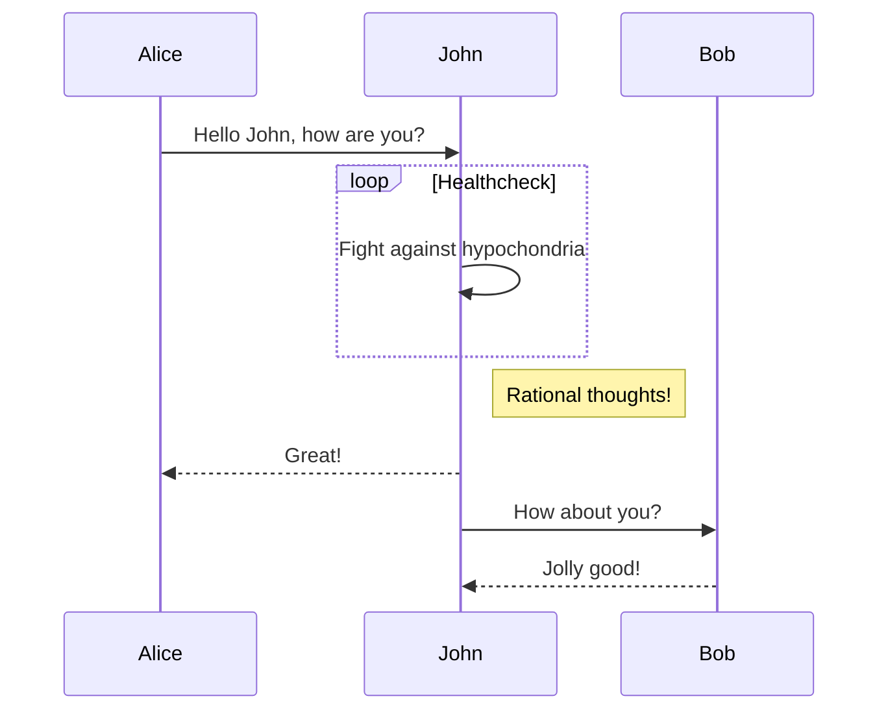
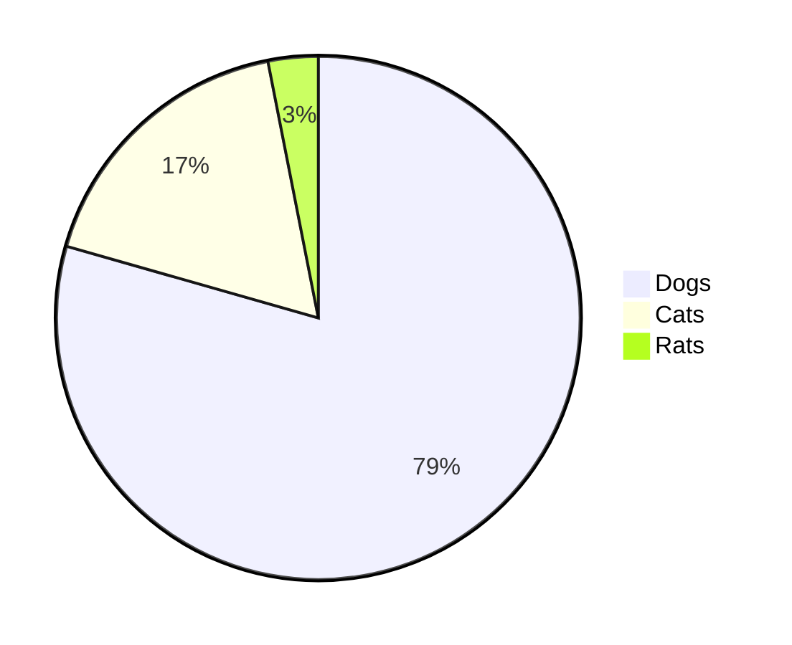

## 目次

## 要点

ブログを自作した。欲しかったのは以下だ：

1. 自由
1. 管理しやすさ
1. 高速性・拡張性
1. 無広告

### 自由

意味はさまざまだが、ここでは外部サービスを念頭に置いている。

書くということにあたっては、[この記事](https://sumirehibiya.com/notes/building-a-blog-with-nextjs)が指摘するようなサービスごとのコミュニティの存在というのも見逃せない。はてな村のムラ社会は言うまでもないが、Note は水で薄めたようなエモが増えているように（勝手に）思うし、

多くが接続されすぎている。

### 管理しやすさ

#### 記事

われわれには先人の記憶というものがあり、すなわちこの手のサイトは記事管理が億劫になった時点で**エタる**。放置された「〇〇の部屋」、消えて還らない借りドメイン、むなしく刻む入室カウンターたちを眺めるたびに、せめて記事くらいは慣れたファイル形式で楽に扱いたいと思うようになった。そういうわけで Markdown（内容管理） + tsx（テンプレートエンジン）。Markdown ならそう簡単には廃れないだろうし、いつか別サービスにも投げ込める安心感がある。

Markdown の処理系には remark / rehype を選択した。[unified](https://github.com/unifiedjs/unified)の API が使えて、後述の豊富なプラグイン群が揃っているのが理由だ。その反面、同じことを実装するのにも選択肢が複数ある。たとえば今回のように Markdown から Next.js の ページを生成するだけでも、以下の五種類（以上）から選ぶことになる。

- `unified`上で実行するもの
  - `remark-parse` + `remark-rehype` + `rehype-stringify`
  - `remark-parse` + `remark-rehype` + `rehype-react`
- そうでないもの（上の処理が複合されたプラグイン）
  - `remark` + `remark-html`
  - `react-remark`
  - `react-markdown`

自分は柔軟にプラグインを組み合わせ、React コンポーネントとも融和させたかったため、このうち上から二番目を採った（後述するが、`rehype-react`がかなり魅力的だ）。

#### CI・ビルド・ホスティング

テストとプレビューを GitHub Actions、ライブラリ更新を renovate で自動化している。これが全部無料で回るのだから、GitHub の懐の広さには本当に頭が上がらない。ホスティングは素直に Vercel に投げた。ほとんど囲い込まれたようなものだが、とくに拘りはないので Cloudflare Pages あたりに変えても良いかもしれない。ちなみに Vercel 側のビルド回数を抑えるため、デフォルトのレポジトリ連携は切り、CI で念入りにテストしてから Vercel CLI 経由でのデプロイを行うようにしてある（[vercel-action](https://github.com/amondnet/vercel-action/)）。せめてもの配慮（？）だ。

### 高速性・拡張性

パフォーマンスが良いらしいと聞いて Next.js の SSG を選択した。SSG とはいいながら、ページ遷移のたびに JS が走るので動きはなめらかだ（言い方を変えれば、ピュアではない）。画像最適化やルーティングの抽象化も向こうでやってくれる。Gatsby みたいにプラグインでガチガチに固める感じでもないので、引っ張ってきたライブラリや自作の処理も素直に持ち込めるのが良いと思った。

### 無広告

[この記事](/blog/posts/nextdns-install)からわかるように、広告の遍在に対して個人的な憎悪を燃やしているため、このサイトには一切置いていない。あるのは Vercel が（おそらく）行っているアナリティクスだけだ。

## 機能

以下では具体的に実装できた機能と、使ったライブラリを書く。

### Frontmatter

Markdown 冒頭に記事のメタデータを記載し、`grey-matter`で取り出している（これは unified の処理ではない）。

https://github.com/jonschlinkert/gray-matter

```md
---
slug: "blog-renewal"
title: "Next.jsでブログをつくった"
date: "20220326"
tags: ["tech", "web", "nextjs"]
---
```

### GitHub Flavored Markdown

`remark-gfm`で対応。

https://github.com/remarkjs/remark-gfm

```md
| 表を     | 作る       |
| -------- | ---------- |
| たとえば | このように |
| 要素を   | 増やす     |

https://www.haxibami.net

みたいな生のリンクも置けるし

- こうやって
  - リストが書ける。さらに、[^1]

[^1]: 脚注も使える
```

| 表を     | 作る       |
| -------- | ---------- |
| たとえば | このように |
| 要素を   | 増やす     |

https://www.haxibami.net

みたいな生のリンクも置けるし

- こうやって
  - リストが書ける。さらに、[^1]

[^1]: 脚注も使える

### 絵文字

`remark-gemoji`で変換。

https://github.com/remarkjs/remark-gemoji

`:v:`が :v: になる。

### 数式

`remark-math`と`rehype-katex`を噛ませる。

https://github.com/remarkjs/remark-math

https://github.com/remarkjs/remark-math/tree/main/packages/rehype-katex

```md
> $$
> ( \sum_{k=1}^{n} a_k b_k )^2 \leq ( \sum_{k=1}^{n} {a_k}^2 ) ( \sum_{k=1}^{n} {b_k}^2 )
> $$
```

> $$
> ( \sum_{k=1}^{n} a_k b_k )^2 \leq ( \sum_{k=1}^{n} {a_k}^2 ) ( \sum_{k=1}^{n} {b_k}^2 )
> $$

$e^{i\pi} + 1 = 0$ のようなインライン数式もいける。フォントの設置は必要ないが、`pages/_document.tsx`で CSS の挿入が必要。

```tsx
// pages/_document.tsx

import { Html, Head, Main, NextScript } from "next/document";

export default function Document() {
  return (
    <Html>
      <Head>
        <link
          rel="stylesheet"
          href="https://cdn.jsdelivr.net/npm/katex@0.15.0/dist/katex.min.css"
        />
      </Head>
      <body>
        <Main />
        <NextScript />
      </body>
    </Html>
  );
}
```

### ルビ

[remark-ruby](https://github.com/laysent/remark-ruby)というパッケージがルビを実装しているが、依存関係と API が古くなっていたため、ほぼフォークのような形で別パッケージ（`remark-jaruby`）を実装した。

https://github.com/haxibami/remark-jaruby

元のパッケージ自体が`remark-parse`のパーサである[micromark](https://github.com/micromark/micromark)に介入していたので、パーサ部分（[micromark-extension-jaruby](https://github.com/haxibami/micromark-extension-jaruby)）、構文木操作部分（[mdast-util-jaruby](https://github.com/haxibami/mdast-util-jaruby)）の拡張機能に分割し、これらを`remark-jaruby`から参照している。

```md
> 昨日午後、{†聖剣†}^(エクスカリバー)を振り回す{全裸中年男性}^(無敵の人)が出現し……
```

> 昨日午後、{†聖剣†}^(エクスカリバー)を振り回す{全裸中年男性}^(無敵の人)が出現し……

### リンクカード

外部リンクをカードに変換するやつ。

https://zenn.dev/tomi/articles/2021-03-22-blog-card

https://zenn.dev/januswel/articles/745787422d425b01e0c1

:point_up_2: を参考にしつつ、unified の Transformer プラグインとして実装した。Markdown 内のリンクを取得して適当な HTML 要素（`<extlink>`）に置き換えたのち、リンク先にアクセスして得たメタ情報を挿入、`rehype-react`の`components`オプションを使ってカスタムコンポーネントに変換している。

```ts
// lib/rehype-react.ts
// HTML parser on "Client" side. Never include backend code (including remark).

import { unified } from "unified";
import rehypeParse from "rehype-parse";
import rehypeReact from "rehype-react";
import type { Options as RehypeReactOptions } from "rehype-react";
import React from "react";
import MyLink from "components/MyLink";
import type { MyLinkProps } from "components/MyLink";
import LinkWidget from "components/LinkWidget";
import type { LinkWidgetProps } from "components/LinkWidget";
import NextImage from "components/NextImage";
import type { NextImageProps } from "components/NextImage";

// Convert HTML to React Component
export const HtmlToReact = (html: string) => {
  const result = unified()
    .use(rehypeParse, {
      fragment: true,
    })
    .use(rehypeReact, {
      createElement: React.createElement,
      components: {
        a: (props: MyLinkProps) => {
          return MyLink(props);
        },
        img: (props: NextImageProps) => {
          return NextImage(props);
        },
        extlink: (props: LinkWidgetProps) => {
          return LinkWidget(props);
        },
      },
    } as RehypeReactOptions)
    .processSync(html);
  return result.result;
};
```

メタ情報の取得には、`metadata-scraper`という便利なライブラリを使った。

https://github.com/BetaHuhn/metadata-scraper#readme

なお、内部で`fetch`を行っている都合上、作成したプラグインは非同期プラグインとなることに留意。具体的には unified で`processSync`が[使えなくなる](https://github.com/unifiedjs/unified#processorprocesssyncfilevalue)。

### ページ内リンク・目次

`rehype-slug`、`rehype-autolink-headings`、`remark-toc`で実現。heading に slug を振ってくれるそうな。

https://github.com/rehypejs/rehype-slug

https://github.com/rehypejs/rehype-autolink-headings

https://github.com/remarkjs/remark-toc

### 内容プレビュー

[トップ](https://haxibami.net/blog)の記事タイルには内容のプレビューを表示している。このために生の Markdown を流し込むのも気が引けたので、なんとかして plaintext 形式に変換できないかと考えていたら、`strip-markdown`というのがあった。これで`<h1>`, `<blockquote>`等を除去し、冒頭 200 字を抽出している。

https://github.com/remarkjs/strip-markdown

### Mermaid のサポート

[remark-mermaid](https://github.com/temando/remark-mermaid)は古く、[remark-mermaidjs](https://github.com/remcohaszing/remark-mermaidjs)は API が unified のものではなかったため、後者をベースにしつつ手元で実装した。裏でヘッドレス Chromium を立ち上げて SVG を生成しているが、想像以上に高速だ。

````md



````


### シンタックスハイライト

最初は[prism.js](https://prismjs.com)を使っていたが、使えるカラースキームがあまりに少なかったため[shiki](https://shiki.matsu.io)に変更した。公式サイトにある通り、こちらは VSCode のカラースキームファイルが流用できる。せっかくなので自作の[urara-vscode](https://github.com/haxibami/urara-vscode)を使用してみた。

https://github.com/shikijs/shiki

以上を合わせたメソッドチェーンが以下。[^2]

[^2]: 変なファイル処理が入っているのは、shiki がテーマファイルを読み込むにあたって**自分のインストールされた位置**（メインプロジェクトの`node_modules`以下）からの相対パスか、ファイルシステムの絶対パスかのいずれかしか受け付けないため。

```ts
// lib/parser.ts
// Markdown parser on "Server" side. Never include frontend code (including rehype-react).

import { join } from "path";
import { unified } from "unified";
import remarkParse from "remark-parse";
import remarkGfm from "remark-gfm";
import remarkGemoji from "remark-gemoji";
import remarkMath from "remark-math";
import remarkJaruby from "remark-jaruby";
import remarkUnwrapImages from "remark-unwrap-images";
import remarkToc from "remark-toc";
import remarkRehype from "remark-rehype";
import type { Options as RemarkRehypeOptions } from "remark-rehype";
import rehypeKatex from "rehype-katex";
import * as shiki from "shiki";
import rehypeShiki from "@leafac/rehype-shiki";
import rehypeSlug from "rehype-slug";
import rehypeAutolinkHeadings from "rehype-autolink-headings";
import rehypeStringify from "rehype-stringify";
import stripMarkdown from "strip-markdown";
import remarkStringify from "remark-stringify";
import { remarkLinkWidget, extLinkHandler } from "./remark-link-widget";

// Get shiki theme file (`src/styles/shiki/${themename}.json`) full path
const getThemePath = (themename: string) =>
  join(process.cwd(), "src/styles/shiki", `${themename}.json`);

// Convert Markdown to HTML
export const MdToHtml = async (md: string) => {
  const myShikiTheme = await shiki.loadTheme(getThemePath("urara-color-theme"));
  const result = await unified()
    .use(remarkParse)
    .use(remarkGfm)
    .use(remarkGemoji)
    .use(remarkMath)
    .use(remarkJaruby)
    .use(remarkLinkWidget)
    .use(remarkUnwrapImages)
    .use(remarkToc, {
      heading: "目次",
      tight: true,
    })
    .use(remarkRehype, {
      handlers: {
        extlink: extLinkHandler,
      },
    } as RemarkRehypeOptions)
    .use(rehypeKatex)
    .use(rehypeShiki, {
      highlighter: await shiki.getHighlighter({ theme: myShikiTheme }),
    })
    .use(rehypeSlug)
    .use(rehypeAutolinkHeadings, {
      behavior: "wrap",
    })
    .use(rehypeStringify)
    .process(md);

  return result.toString();
};

// Convert Markdown to plaintext: for preview in top pages
export const MdStrip = async (md: string) => {
  const result = unified()
    .use(remarkParse)
    .use(stripMarkdown, {
      remove: ["heading", "list", "blockquote", "code", "image"],
    })
    .use(remarkStringify)
    .processSync(md);

  return result.toString();
};
```

以上の処理で、はてブや Qiita、Zenn あたりと似た書き心地になった。

### ダークモード

外部ライブラリを使用。

https://github.com/pacocoursey/next-themes

### 動的 OGP 画像の自動生成

Vercel のサーバレス関数機能を使って

1. ヘッドレス Chromium を起動
2. クエリパラメータに応じた内容の React コンポーネントを生成
3. `renderToStaticMarkup`で静的 HTML 化
4. 表示してスクリーンショットを撮影

する手順で実現した。この方法だと表示する内容を手元で書けるぶん、デザインの自由度が高い。

バイナリには[playwright-aws-lambda](https://github.com/JupiterOne/playwright-aws-lambda)を使った。

```tsx
// pages/api/ogp.tsx

import React from "react";
import chromium from "chrome-aws-lambda";
import type { NextApiRequest, NextApiResponse } from "next";
import ReactDomServer from "react-dom/server";
import path from "path";
import fs from "fs";
import OgpImage, { OgpInfo } from "components/OgpImage/OgpImage";

// full path resolve
const baseFullPath = path.resolve("./");

// image paths
const faviconPath = path.join(baseFullPath, "public/favicon.ico");
const favicon: string = fs.readFileSync(faviconPath, "base64");

// style paths
const stylePath = path.join(baseFullPath, "src/styles/ogp.css");
const style = fs.readFileSync(stylePath, "utf-8");

const OgpGen = async (req: NextApiRequest, res: NextApiResponse) => {
  const chromePath = {
    production: await chromium.executablePath,
    development: "/opt/google/chrome/google-chrome",
    test: await chromium.executablePath,
  }[process.env.NODE_ENV];

  const viewport = { width: 1200, height: 630 };

  const browser = await chromium.puppeteer.launch({
    args: chromium.args,
    defaultViewport: viewport,
    executablePath: chromePath,
    headless: chromium.headless,
  });
  const page = await browser.newPage();

  const longtitle =
    typeof req.query.title !== "undefined" ? req.query.title.toString() : "";

  const date =
    typeof req.query.date !== "undefined" ? req.query.date.toString() : "";

  const ogpinfo: OgpInfo = {
    title: longtitle,
    date: date,
    icon: favicon,
    style: style,
  };

  const markup = ReactDomServer.renderToStaticMarkup(<OgpImage {...ogpinfo} />);
  const html = `<!doctype html>${markup}`;

  await page.setContent(html, { waitUntil: "networkidle2" });

  const image = await page.screenshot({ type: "png" });
  await browser.close();

  res.setHeader("Cache-Control", "s-maxage=31536000, stale-while-revalidate");

  res.setHeader("Content-Type", "image/png");

  res.end(image);
};

export default OgpGen;
```

ちなみに向こうの環境（AWS Lambda 相当）には CJK 文字のフォントが入っていないため、既に chromium バイナリで容量ギリギリのところにフォントを足すことになり、普通にやると超過する。が、今回は Web フォントを当てることでどうにかした。


ログを見た感じこれでも微妙に容量オーバーしているが、普通に動いている。優しいな〜

### サイトマップ生成

[next-sitemap](https://github.com/iamvishnusankar/next-sitemap)を使ったところ、`<lastmod>`がすべて最終ビルド時を示していて発狂しかけた。この挙動はある意味正しく、なぜなら自分が触れていないページでもビルドするたびに**静的アセットの slug 名が変わってしまう**ためである。仕方がないので[このへん](https://www.mk-engineer.com/posts/nextjs-before-build)を参考にしつつ書いた。npm scripts を活用し、

1. ビルド前に`share/index.json`に記事のインデックスを作成
1. ビルド後にインデックスに基づいて`sitemap.xml`と`robots.txt`を生成

するようにしてある。

```js
// hooks/scripts/sitemap.mjs

import fs from "fs";
import prettier from "prettier";
import { globby } from "globby";

// variables
const HOST = "https://www.haxibami.net";
const XMLFILE = "sitemap.xml";

// Article index file
const indexFile = fs.readFileSync("src/share/index.json", "utf-8");
const index = JSON.parse(indexFile);

// formatted xml
const formatted = (sitemap) => prettier.format(sitemap, { parser: "html" });

const sitemapGenerator = async () => {
  const solidPaths = await globby(
    ["src/pages/*.tsx", "src/pages/blog/*.tsx", "src/pages/grad_essay/*.tsx"],
    { ignore: ["src/pages/_*.tsx", "src/pages/404.tsx"] }
  );

  const solidInfos = solidPaths.map((filePath) => {
    const solidInfo = {
      relpath: filePath
        .replace("src/pages/", "")
        .replace(".tsx", "")
        .replace("index", ""),
      lastmod: new Date().toISOString(),
    };
    return solidInfo;
  });

  const allBlogs = index.articles.blog;
  const allGrads = index.articles.grad_essay;

  const dateConverter = (date) => {
    return date.slice(0, 4) + "-" + date.slice(4, 6) + "-" + date.slice(6);
  };

  const blogInfos = allBlogs.map((item) => {
    const blogInfo = {
      relpath: `blog/posts/${item.slug}`,
      lastmod: dateConverter(item.date),
    };
    return blogInfo;
  });

  const gradInfos = allGrads.map((item) => {
    const gradInfo = {
      relpath: `grad_essay/posts/${item.slug}`,
      lastmod: dateConverter(item.date),
    };
    return gradInfo;
  });

  const sitemapInfos = solidInfos.concat(blogInfos, gradInfos);

  const pagesSitemap = `

  ${sitemapInfos
    .map((info) => {
      return `
        <url>
          <loc>${HOST}/${info.relpath}</loc>
          <lastmod>${info.lastmod}</lastmod>
        </url>
      `;
    })
    .join("")}
  `;

  const generatedSitemap = `
    <?xml version="1.0" encoding="UTF-8"?>
    <urlset
      xmlns="http://www.sitemaps.org/schemas/sitemap/0.9"
      xmlns:xsi="http://www.w3.org/2001/XMLSchema-instance"
      xsi:schemaLocation="http://www.sitemaps.org/schemas/sitemap/0.9 http://www.sitemaps.org/schemas/sitemap/0.9/sitemap.xsd"
    >
      ${pagesSitemap}
    </urlset>
  `;

  const robots = `# *
User-agent: *
Allow: /

# Host
Host: https://www.haxibami.net

# Sitemaps
Sitemap: https://www.haxibami.net/sitemap.xml
`;

  fs.writeFileSync(`public/${XMLFILE}`, formatted(generatedSitemap));
  fs.writeFileSync("public/robots.txt", robots);
};

export default () => {
  return new Promise(async (resolve) => {
    sitemapGenerator();
    resolve();
  });
};
```

```json
// package.json

{
  "scripts": {
    "prebuild": "node hooks/before-build.mjs",
    "build": "next build",
    "postbuild": "node hooks/after-build.mjs"
  }
}
```

### フィード対応

`Feed`というライブラリを使った。上と同じ要領で、ビルド時に`/public/rss`以下に RSS、Atom、JSON Feed 用のファイル三種を吐かせている。

```js
// hooks/scripts/feed.mjs
import fs from "fs";
import { Feed } from "feed";
import { readYaml, getAllPosts, MdToHtml, dateConverter } from "./lib.mjs";

// variables
const HOST = "https://www.haxibami.net";

const meta = readYaml("meta.yaml");

const genRssFeed = () => {
  const author = {
    name: "haxibami",
    email: "contact@haxibami.net",
    link: HOST,
  };

  const date = new Date();
  const feed = new Feed({
    title: meta.siteinfo.blog.title,
    description: meta.siteinfo.blog.description,
    id: HOST,
    link: HOST,
    language: "ja",
    image: `${HOST}/favicon.png`,
    copyright: `All rights reserved ${date.getFullYear()}, ${author.name}`,
    updated: date,
    feedLinks: {
      rss2: `${HOST}/rss/feed.xml`,
      json: `${HOST}/rss/feed.json`,
      atom: `${HOST}/rss/atom.xml`,
    },
    author: author,
  });

  const allBlogs = getAllPosts(["slug", "title", "date", "content"], "blog");

  allBlogs.forEach((post) => {
    const url = `${HOST}/blog/posts/${post.slug}`;
    feed.addItem({
      title: post.title,
      description: `<p>${MdToHtml(post.content).substring(0, 300)}</p>`,
      id: url,
      link: url,
      date: new Date(dateConverter(post.date)),
    });
  });

  fs.mkdirSync("public/rss", { recursive: true });
  fs.writeFileSync("public/rss/feed.xml", feed.rss2());
  fs.writeFileSync("public/rss/atom.xml", feed.atom1());
  fs.writeFileSync("public/rss/feed.json", feed.json1());
};

export default genRssFeed;
```

## 感想

Next.js の抽象化と、unified はじめ充実した外部処理系に助けられてかなり簡単に動いた。デベロッパーに五体投地しつつ、改修・保守をやっていく。

## TODO

- [x] ルビの実装（2022/03/06）
- [x] フィード（RSS, Atom）対応（2022/03/10）
- [x] 外部リンクのカード化（2022/03/15）
- [x] ダークモードのサポート（2022/03/22）
- [x] Mermaid のサポート（2022/03/26）
- [ ] Twitter コンテンツの静的埋め込み
