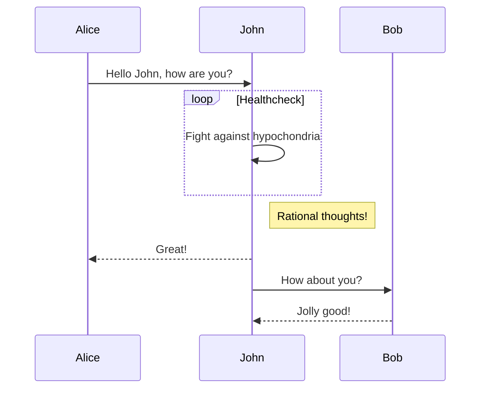
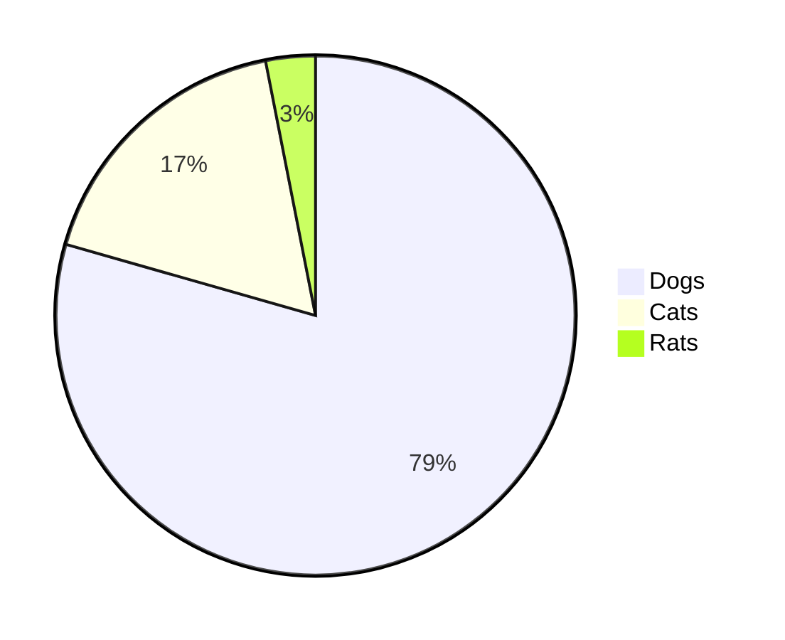

## はじめに

<https://github.com/haxibami/haxibami.net>

ブログを自作した。決め手は以下の四つ。

1. 適度な距離感
1. メンテナンス性
1. 高速性・拡張性
1. 無広告

### 1. 適度な距離感

あらゆるものが最適化されて提供される環境にあっては、遅配や誤配の確率は十分に低くなる。大きなプラットフォームはユーザーの buzz をすすんで後押しし、かれに向けて、かれのために、とパーソナライズに躍起だ。書き手と読み手の距離は透明に、コミュニケーションは確実に。だがそうではない形式もあった。ひょっとしたら誰かに拾われるかもしれない、あるいはクローラにさえ拾われないかもしれない、そうした確率論的な雲のなかに自らの書いたものを打ち上げる。そして祈る。{古き良き日々}^(グッド・オールド・インターネッツ)は理想郷ではなかったにしても、あの誰かのものになる前の世界の、その歪な手触りを覚えておくための、この距離感。

### 2. メンテナンス性

ご存知のとおり、この手のサイトは管理・移行が億劫になった時点で**エタる**。放置された「〇〇の部屋」、消えて還らない借りもののドメイン、むなしく刻む入室カウンターたちを眺めるたびに、せめて記事くらいは慣れたファイル形式で楽に扱いたいと思うようになった。そういうわけで Markdown（コンテンツ） + tsx（テンプレート）、さらに GitHub デプロイでの自動ビルド。この組み合わせならそう簡単には廃れないだろうし、いつか別サービス・別フレームワークに移るときにもそれほど困らない。

（2022/12/28 更新）

Markdown の処理系について。以前は`remark` + `rehype`の出力を`rehype-react` でレンダリングしていたが、`rehype-react`（厳密にいえばその依存先の`parse5`）のバンドルサイズがバカにならないので、`next-mdx-remote`に乗り換えた。

<https://github.com/hashicorp/next-mdx-remote>

これは 名前の通り MDX / Markdown を処理するユーティリティで、内部では`remark` / `rehype`系の API を用いているため、ほぼ変更なくツールチェインを持ち込める。またバンドルサイズの削減にも注意が払われている[らしく](https://github.com/hashicorp/next-mdx-remote#background--theory)、実際に私の環境では `rehype-react`比で 200KB ほどバンドルが小さくなった。

```ts title="lib/compile.ts"
import { serialize } from "next-mdx-remote/serialize";
import rehypeAutolinkHeadings from "rehype-autolink-headings";
import rehypeKatex from "rehype-katex";
import rehypePrettyCode from "rehype-pretty-code";
import rehypeRaw from "rehype-raw";
import rehypeSlug from "rehype-slug";
import remarkGemoji from "remark-gemoji";
import remarkGfm from "remark-gfm";
import remarkJaruby from "remark-jaruby";
import remarkMath from "remark-math";
import remarkUnwrapImages from "remark-unwrap-images";

import { remarkLinkWidget, extLinkHandler } from "lib/remark-link-card";
import remarkMermaid from "lib/remark-mermaid";

import type { Options } from "rehype-pretty-code";

export const compileMdx = async (file: string) => {
  const options: Partial<Options> = {
    theme: {
      dark: "rose-pine-moon",
    },
    onVisitLine(node) {
      if (node.children.length === 0) {
        node.children = [{ type: "text", value: " " }];
      }
    },
    onVisitHighlightedLine(node) {
      node.properties.className.push("highlighted");
    },
    onVisitHighlightedWord(node) {
      node.properties.className = ["word"];
    },
  };

  // compile md(x)
  const mdxSource = await serialize(file, {
    mdxOptions: {
      remarkPlugins: [
        remarkGfm,
        remarkGemoji,
        remarkMath,
        remarkJaruby,
        remarkLinkWidget,
        remarkUnwrapImages,
        [
          remarkMermaid,
          {
            launchOptions: {
              args: ["--no-sandbox", "--disable-setuid-sandbox"],
            },
            wrap: true,
            className: ["mermaid"],
          },
        ],
      ],
      rehypePlugins: [
        rehypeSlug,
        [rehypeAutolinkHeadings, { behavior: "wrap" }],
        rehypeKatex,
        [rehypePrettyCode, options],
        rehypeRaw,
      ],
      remarkRehypeOptions: {
        handlers: {
          extlink: extLinkHandler,
        },
      },
      format: "md",
      development: false,
    },
    parseFrontmatter: true,
  });

  return mdxSource;
};
```


### 3. 高速性・拡張性

個人サイトに Next.js は若干オーバーキル感もあるが、まあページ遷移が気持ちいいし、Vercel なら画像最適化効くし……こうしてベンダーロックインへと突き進んでゆくのでした。あと少々複雑なことをしようとしてもフレームワークの守備範囲をはみ出さないというのは良い。

### 4. 広告や統計の排除

過剰な広告・統計に対して憎悪を抱いているため、このサイトには一切設置していない。唯一、このサイトのホスト先である Vercel が行っているアナリティクスだけは確認している。[こちらの記事](/blog/posts/nextdns-install)も参照。

## 展示会

以下はこのブログの機能・実装の展示会。

### 記事メタデータの取り扱い

`remark-frontmatter`と`vfile-matter`で frontmatter から記事のメタデータを取得。また`strip-markdown`で本文中の余分な要素を除去し、冒頭 300 字程度を抽出したものを各記事のプレビューとして表示している。

<https://github.com/remarkjs/remark-frontmatter>

<https://github.com/vfile/vfile-matter>

<https://github.com/remarkjs/strip-markdown>

```md
---
slug: "blog-renewal"
title: "Next.jsでブログをつくった"
date: "20220326"
tags: ["tech", "web", "nextjs"]
---
```

```ts title="lib/parser.ts"
// Markdown parser for metadata & preview data

import remarkFrontmatter from "remark-frontmatter";
import remarkParse from "remark-parse";
import remarkStringify from "remark-stringify";
import stripMarkdown from "strip-markdown";
import { unified } from "unified";
import { matter } from "vfile-matter";

import type { VFile } from "vfile-matter";

declare module "vfile" {
  interface DataMap {
    matter: {
      slug: string;
      title: string;
      date?: string;
      description: string;
      tags?: string[];
    };
  }
}

/**
 * Plugin to parse YAML frontmatter and expose it at `file.data.matter`.
 *
 * @type {import('unified').Plugin<Array<void>>}
 */
export default function remarkParseMatter() {
  return function (_: void, file: VFile) {
    matter(file);
  };
}

export const mdInfo = async (md: string) => {
  const result = await unified()
    .use(remarkParse)
    .use(stripMarkdown, {
      remove: ["heading", "list", "blockquote", "code", "image"],
    })
    .use(remarkStringify)
    .use(remarkFrontmatter)
    .use(remarkParseMatter)
    .process(md);

  return {
    preview: result.toString().substring(0, 300),
    data: result.data.matter,
  };
};
```

### GitHub Flavored Markdown

<https://github.com/remarkjs/remark-gfm>

```md
| 表を     | 作る       |
| -------- | ---------- |
| たとえば | このように |
| 要素を   | 増やす     |

<https://www.haxibami.net>

みたいな生のリンクも置けるし

- こうやって
  - リストが書ける。さらに、[^1]

[^1]: 脚注も使える
```

| 表を     | 作る       |
| -------- | ---------- |
| たとえば | このように |
| 要素を   | 増やす     |

<https://www.haxibami.net>

みたいな生のリンクも置けるし

- こうやって
  - リストが書ける。さらに、[^1]

[^1]: 脚注も使える

### 絵文字

<https://github.com/remarkjs/remark-gemoji>

`:v:`が :v: に。

### 数式

<https://github.com/remarkjs/remark-math>

<https://github.com/remarkjs/remark-math/tree/main/packages/rehype-katex>

フォントの設置は必要ないが、KaTeX のスタイルシートを置いておく必要がある。

```tsx title="pages/blog/posts/[slug].tsx"
const Blog: NextPage<Props> = ({ pageMetaData, post, content }) => {
  return (
    <div id={Styles.Wrapper}>
      <div id={Styles.Container}>
        <MyHead {...pageMetaData} />
        <Head>
          <link
            rel="stylesheet"
            href="https://cdn.jsdelivr.net/npm/katex@0.15.3/dist/katex.min.css"
            integrity="sha384-KiWOvVjnN8qwAZbuQyWDIbfCLFhLXNETzBQjA/92pIowpC0d2O3nppDGQVgwd2nB"
            crossOrigin="anonymous"
          />
        </Head>
// (略)
```

```md
> $$
> ( \sum_{k=1}^{n} a_k b_k )^2 \leq ( \sum_{k=1}^{n} {a_k}^2 ) ( \sum_{k=1}^{n} {b_k}^2 )
> $$
```

> $$
> ( \sum_{k=1}^{n} a_k b_k )^2 \leq ( \sum_{k=1}^{n} {a_k}^2 ) ( \sum_{k=1}^{n} {b_k}^2 )
> $$

$e^{i\pi} + 1 = 0$ :arrow_left: インライン数式

### ルビ

`remark-ruby`というパッケージをフォークする形で、別パッケージ（`remark-jaruby`）を実装。

<https://github.com/haxibami/remark-jaruby>

```md
> 昨日午後、{†聖剣†}^(エクスカリバー)を振り回す{全裸中年男性}^(無敵の人)が出現し……
```

> 昨日午後、{†聖剣†}^(エクスカリバー)を振り回す{全裸中年男性}^(無敵の人)が出現し……

### ページ内リンク

<https://github.com/rehypejs/rehype-slug>

<https://github.com/rehypejs/rehype-autolink-headings>

[はじめに](#はじめに)に飛べるよ

### Mermaid Diagram

[remark-mermaidjs](https://github.com/remcohaszing/remark-mermaidjs)をベースに remark プラグインを書いた。裏でヘッドレス Chromium を立ち上げて SVG を描画、出力している。サイト内に JS を設置してユーザー側で動的にレンダリングさせることもできるが、事前に静的な SVG に変換できたほうが嬉しい。

```ts title="lib/remark-mermaid.ts"
...

const remarkMermaid: Plugin<[RemarkMermaidOptions?]> = function mermaidTrans(
  options
): Transformer {
  const DEFAULT_SETTINGS = {
    launchOptions: {
      args: ["--no-sandbox", "--disable-setuid-sandbox"],
    },
    theme: "default",
    wrap: false,
    classname: [],
  };

  const settings = Object.assign({}, DEFAULT_SETTINGS, options);

  // eslint-disable-next-line @typescript-eslint/no-unused-vars
  return async (node: Node, _file: VFileCompatible) => {
    const promises: (() => Promise<void>)[] = [];
    const browser = await playwright.chromium.launch(settings.launchOptions);
    const context = await browser.newContext({
      viewport: { width: 1000, height: 3000 },
    });
    const page = await context.newPage();
    const html = `<!DOCTYPE html>`;
    await page.setContent(html);
    await page.addScriptTag({
      url: "https://unpkg.com/mermaid/dist/mermaid.min.js",
      type: "module",
    });
    await page.setViewportSize({ width: 1000, height: 3000 });
    visit(node, isMermaid, visitor);
    await Promise.all(promises.map((t) => t()));
    await browser.close();

    function visitor(node: Code, index: number, parent: Parent | undefined) {
      if (!isParent(parent)) {
        return;
      }
      promises.push(async () => {
        const svg = await getSvg(node, page, settings.theme);
        if (settings.wrap) {
          parent.children[index] = {
            type: "parent",
            children: [],
            data: {
              hChildren: [
                {
                  type: "element",
                  children: [svgParse(svg)],
                  tagName: "div",
                  properties: {
                    className: settings.classname,
                  },
                },
              ],
            },
          } as Parent;
        } else {
          parent.children[index] = {
            type: "paragraph",
            children: [],
            data: {
              hChildren: [svgParse(svg)],
            },
          } as Paragraph;
        }
      });
      return true;
    }
  };
};

async function getSvg(node: Code, page: playwright.Page, theme: Theme) {
  const graph = await page.evaluate(
    ([code, theme]) => {
      const id = "a";
      const config: MermaidConfig = {
        theme: theme as Theme,
        startOnLoad: false,
      };
      mermaid.mermaidAPI.initialize(config);
      const div = document.createElement("div");
      mermaid.mermaidAPI.render(id, code, (svg: string) => {
        div.innerHTML = svg;
      });
      return div.innerHTML;
    },
    [node.value, theme]
  );

  ...
}
```

````md



````


### シンタックスハイライト

`rehype-pretty-code`を採用。このパッケージは内部で[shiki](https://shiki.matsu.io)を利用しており、ファイル名や行数の表示、行ハイライトなどの機能を追加した実質的なラッパーになっている。shiki はコード解析・スタイル適用がビルド時にすべて済む（出力が静的）、VSCode のカラースキームファイルが使える、などの強みがある。

<https://github.com/atomiks/rehype-pretty-code>

<https://github.com/shikijs/shiki>

### リンクカード

<https://zenn.dev/tomi/articles/2021-03-22-blog-card>

<https://zenn.dev/januswel/articles/745787422d425b01e0c1>

:point_up_2: を参考にしつつ、unified の Transformer プラグインとして実装した。文書中のリンク（`Paragraph`ノードかつ、子要素が単一の`Link`ノードであるもの）を取得し、適当な独自ノード（`<extlink>`）に置き換えたのち、リンク先にアクセスして得たメタ情報（title、description、OGP 画像 URL 等）を持たせている。これを`<MDXRemote>`の`components`オプションを使ってカスタムコンポーネントに変換することで、好きなスタイルでリンクカードが表示できる。

```ts title="lib/remark-link-card.ts"
import getMetadata from "metadata-scraper";
import { visit } from "unist-util-visit";

import { isParent, isLink, isParagraph } from "./mdast-util-node-is";

import type { Paragraph, Link, Literal } from "mdast";
import type { H } from "mdast-util-to-hast";
import type { Plugin, Transformer } from "unified";
import type { Node, Parent } from "unist";
import type { VFileCompatible } from "vfile";

interface ExtLink extends Literal {
  type: "extlink";
  meta: LinkWidgetMeta;
}

interface LinkWidgetMeta {
  url: string;
  title: string;
  description: string;
  og: string;
  icon: string;
}

function isExtLink(node: unknown): node is Paragraph {
  if (!isParagraph(node)) {
    return false;
  }

  const { children } = node;

  if (children.length != 1) {
    return false;
  }

  const singleChild = children[0];
  if (!(isLink(singleChild) && singleChild.children[0].type == "text")) {
    return false;
  }

  return true;
}

function fetchMeta(url: string) {
  const metas = getMetadata(url).then((data) => {
    const metaData: LinkWidgetMeta = {
      url: url,
      title: data.title ?? "",
      description: data.description ?? "",
      og: data.image ?? "",
      icon: data.icon ?? "",
    };
    return metaData;
  });
  return metas;
}

export const remarkLinkWidget: Plugin = function extLinkTrans(): Transformer {
  // eslint-disable-next-line @typescript-eslint/no-unused-vars
  return async (tree: Node, _file: VFileCompatible) => {
    const promises: (() => Promise<void>)[] = [];
    visit(tree, isExtLink, visitor);
    await Promise.all(promises.map((t) => t()));

    function visitor(
      node: Paragraph,
      index: number,
      parent: Parent | undefined
    ) {
      if (!isParent(parent)) {
        return;
      }

      if (parent.type === "listItem") {
        return;
      }

      const child = node.children[0] as Link;

      promises.push(async () => {
        const data = await fetchMeta(child.url);
        parent.children[index] = {
          type: "extlink",
          meta: data,
        } as ExtLink;
      });
    }
  };
};

export function extLinkHandler(_h: H, node: ExtLink) {
  return {
    type: "element" as const,
    tagName: "extlink",
    properties: {
      url: node.meta.url,
      title: node.meta.title,
      description: node.meta.description,
      og: node.meta.og,
      icon: node.meta.icon,
    },
    children: [],
  };
}
```

なお、内部で`fetch`を行っている都合上、作成したプラグインは非同期プラグインとなることに留意。具体的には unified で`processSync`が[使えなくなる](https://github.com/unifiedjs/unified#processorprocesssyncfile)。

### 画像とリンクの処理

Markdown で挿入した画像はそのままでは通常の``タグに変換されるため、Next.js の画像最適化の対象にはならない。が、これも`<MDXRemote>`の`components`オプションで独自のコンポーネントに置換することで解決できる。以下の例では画像にリンクを付加し、`alt`テキストをキャプションとして追記している。同様のことがリンク（`<a>`タグ →`<Link>`）についても可能。

```tsx title="components/NextImage.tsx"
import React from "react";

import Image from "next/image";
import Link from "next/link";

import Styles from "./style.module.scss";

export type NextImageProps = {
  src: string;
  alt?: string;
};

const NextImage: React.FC<NextImageProps> = (props) => {
  const { src, alt } = props;
  return alt !== "asciicast" ? (
    <figure className={Styles.Figure}>
      <Link href={src} scroll={false}>
        <div className={Styles.ImgBox}>
          <Image
            className={Styles.Img}
            src={src}
            alt={alt || src}
            fill={true}
          />
        </div>
      </Link>
      <figcaption>{alt}</figcaption>
    </figure>
  ) : (
    <div className={Styles.ImgBox}>
      <Image className={Styles.Img} src={src} alt={alt} fill={true} />
    </div>
  );
};

export default NextImage;
```

### ダークモード

外部ライブラリを使用。

<https://github.com/pacocoursey/next-themes>

### 動的 OGP 画像の自動生成

（2022/12/28 更新）

以前のヘッドレス Chromium を使った実装から、Vercel 公式が提供する[新しいアプローチ](https://vercel.com/docs/concepts/functions/edge-functions/og-image-generation)（`@vercel/og`）に乗り換えた。[yoga-layout](https://yogalayout.com/)かなにかのスタイリングエンジンを WASM で動かしているらしく、かなり速い。しかも Tailwind が使える（ただし使える CSS ルールは限定的）。

```tsx title="pages/api/ogp.tsx"
import type { NextRequest } from "next/server";

import { ImageResponse } from "@vercel/og";

export const config = {
  runtime: "experimental-edge",
};

const handler = async (req: NextRequest) => {
  try {
    const { searchParams } = new URL(req.url);
    const title = searchParams.has("title")
      ? searchParams.get("title")?.slice(0, 80)
      : "";
    const date = searchParams.has("date")
      ? `📅 ― ${searchParams.get("date")?.slice(0, 8)}`
      : "";

    // CJK font is so large that if placed locally it easily exceeds the 1MB Edge Function limit >_<
    const notoFontData = await fetch(
      "https://rawcdn.githack.com/haxibami/Noto-Sans-CJK-JP/master/fonts/NotoSansCJKjp-Bold.woff"
    ).then((res) => res.arrayBuffer());

    const robotoFontData = await fetch(
      new URL("../../assets/RobotoMono-Medium.woff", import.meta.url)
    ).then((res) => res.arrayBuffer());

    const pngIcon = new URL(
      "../../assets/icon_ange_glasses_192.png",
      import.meta.url
    ).toString();

    return new ImageResponse(
      (
        <div
          style={{
            height: "100%",
            width: "100%",
            display: "flex",
            flexDirection: "column",
            alignItems: "center",
            justifyContent: "center",
            padding: "30px",
            fontFamily: "Noto Sans CJK JP",
            backgroundColor: "#171726",
            color: "#f2f0e6",
          }}
        >
          <div tw="flex flex-col p-12 w-full h-full border-solid border-4 border-white rounded-xl">
            <div tw="flex flex-1 max-w-full items-center max-h-full">
              <h1 tw="text-6xl leading-tight max-w-full">
                <p tw="w-full justify-center">{title}</p>
              </h1>
            </div>
            <div tw="flex flex-row justify-between items-center w-full">
              <div tw="flex items-center">
                {/* eslint-disable-next-line @next/next/no-img-element */}
                
                <h2 tw="text-4xl mr-5">
                  <p
                    style={{
                      fontFamily: "Roboto Mono",
                    }}
                  >
                    haxibami.net
                  </p>
                </h2>
              </div>
              <div tw="flex">
                <h2 tw="text-4xl">
                  <p>{date}</p>
                </h2>
              </div>
            </div>
          </div>
        </div>
      ),
      {
        fonts: [
          {
            name: "Noto Sans CJK JP",
            data: notoFontData,
            weight: 700,
            style: "normal",
          },
          {
            name: "Roboto Mono",
            data: robotoFontData,
            weight: 500,
            style: "normal",
          },
        ],
      }
    );
  } catch (e) {
    console.log(`${e}`);
    return new Response(`Failed to generate the image`, {
      status: 500,
    });
  }
};

export default handler;
```

なお、この関数は Edge 環境で実行されるため、総容量制限は**1MB**とかなり厳しい。日本語フォントは内蔵のもの（Noto Sans JP？）で妥協するか、サブセット化したものを Web フォントとしてロードするしかない。

### サイトマップ生成

frontmatter に記載した情報に合わせてサイトマップを生成したかったので、[このへん](https://www.mk-engineer.com/posts/nextjs-before-build)を参考にしつつ自分で書いた。npm scripts を活用し、

1. ビルド前に記事のインデックスをキャッシュ
1. キャッシュに基づいて`public/sitemap.xml`と`public/robots.txt`を生成

するようにしてある。

```js title="hooks/scripts/sitemap.mts"
import fs from "fs";

import { globby } from "globby";
import prettier from "prettier";

import { dateConverter } from "./lib/build.js";
import { HOST } from "./lib/constant.js";

import type { PostData } from "./lib/interface.js";

// variables
const XMLFILE = "sitemap.xml";

// Article index file
const postIndexFile = fs.readFileSync("src/share/index.json", "utf-8");
const postIndex = JSON.parse(postIndexFile);

// format xml
const formatXml = (sitemap: string) =>
  prettier.format(sitemap, { parser: "html" });

// generate sitemap & robots.txt
const sitemapGenerator = async () => {
  const solidPaths = await globby(["src/pages/*.tsx", "src/pages/blog/*.tsx"], {
    ignore: [
      "src/pages/_*.tsx",
      "src/pages/404.tsx",
      "src/pages/grad_essay.tsx",
    ],
  });

  const solidPageInfos = solidPaths.map((filePath) => {
    const solidPageInfo = {
      relpath: filePath
        .replace("src/pages/", "")
        .replace(".tsx", "")
        .replace("index", ""),
      lastmod: new Date().toISOString(),
    };
    return solidPageInfo;
  });

  const blogposts = postIndex.articles.blog;

  const blogInfos = blogposts.map((post: PostData) => {
    const blogInfo = {
      relpath: `blog/posts/${post.data?.slug}`,
      lastmod: dateConverter(post.data?.date),
    };
    return blogInfo;
  });

  const sitemapInfos = solidPageInfos.concat(blogInfos);

  const pagesSitemap = `

  ${sitemapInfos
    .map((info) => {
      return `
        <url>
          <loc>https://${HOST}/${info.relpath}</loc>
          <lastmod>${info.lastmod}</lastmod>
        </url>
      `;
    })
    .join("")}
  `;

  const generatedSitemap = `
<?xml version="1.0" encoding="UTF-8"?>
<urlset
  xmlns="http://www.sitemaps.org/schemas/sitemap/0.9"
  xmlns:xsi="http://www.w3.org/2001/XMLSchema-instance"
  xsi:schemaLocation="http://www.sitemaps.org/schemas/sitemap/0.9 http://www.sitemaps.org/schemas/sitemap/0.9/sitemap.xsd"
>
  ${pagesSitemap}
</urlset>
  `;

  const robots = `# *
User-agent: *
Allow: /

# Host
Host: https://www.haxibami.net

# Sitemaps
Sitemap: https://www.haxibami.net/sitemap.xml
`;

  fs.writeFileSync(`public/${XMLFILE}`, formatXml(generatedSitemap));
  fs.writeFileSync("public/robots.txt", robots);
};

const genSitemap = () => {
  return new Promise<void>((resolve) => {
    sitemapGenerator();
    resolve();
  });
};

export default genSitemap;
```

### フィード対応

`Feed`というライブラリを使った。上と同じ要領で、ビルド時に`/public/rss`以下に RSS、Atom、JSON Feed 用のファイル三種を吐かせている。

<https://github.com/jpmonette/feed>

```js title="hooks/scripts/feed.mts"
import fs from "fs";

import { Feed } from "feed";

import { dateConverter } from "./lib/build.js";
import { SITEDATA } from "./lib/constant.js";
import { getPostsData } from "./lib/fs.js";

// variables
const HOST = "https://www.haxibami.net";

// generate feed
const feedGenerator = async () => {
  const author = {
    name: "haxibami",
    email: "contact@haxibami.net",
    link: HOST,
  };

  const date = new Date();
  const feed = new Feed({
    title: SITEDATA.blog.title,
    description: SITEDATA.blog.description,
    id: HOST,
    link: HOST,
    language: "ja",
    image: `${HOST}/icon_ange_glasses_192.png`,
    favicon: `${HOST}/favicon.ico`,
    copyright: `All rights reserved ${date.getFullYear()}, ${author.name}`,
    updated: date,
    feedLinks: {
      rss2: `${HOST}/rss/feed.xml`,
      json: `${HOST}/rss/feed.json`,
      atom: `${HOST}/rss/atom.xml`,
    },
    author: author,
  });

  const blogs = await getPostsData("articles/blog");

  blogs.forEach((post) => {
    const url = `${HOST}/blog/posts/${post.data?.slug}`;
    feed.addItem({
      title: `${post.data?.title}`,
      description: `${post.preview}`,
      id: url,
      link: url,
      date: new Date(dateConverter(post.data?.date)),
    });
  });

  fs.mkdirSync("public/rss", { recursive: true });
  await Promise.all([
    fs.promises.writeFile("public/rss/feed.xml", feed.rss2()),
    fs.promises.writeFile("public/rss/atom.xml", feed.atom1()),
    fs.promises.writeFile("public/rss/feed.json", feed.json1()),
  ]);
};

const GenFeed = () => {
  return new Promise<void>((resolve) => {
    feedGenerator();
    resolve();
  });
};

export default GenFeed;
```

## 感想

以上で、はてブや Qiita、Zenn あたりに劣らぬ書き心地になった。

~~肝心の記事は全然増えないけど~~

:sob:

## TODO

- [ ] Twitter コンテンツの静的埋め込み
