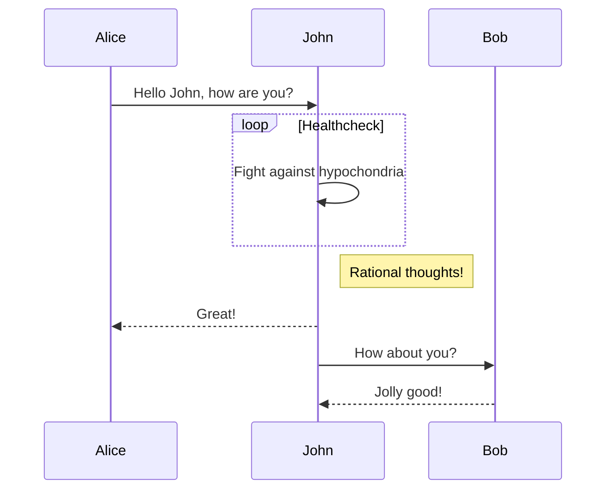
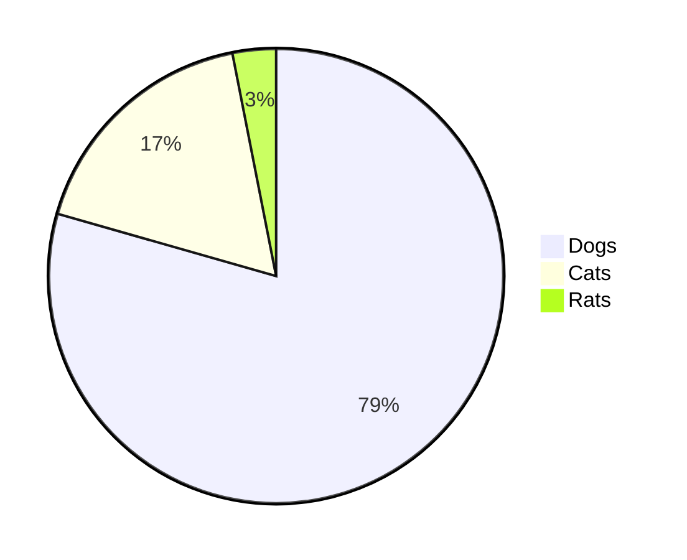

（2022/03/03 追記）Next.js 13 対応を[やった](/blog/posts/blog-next-13)

## はじめに

<https://github.com/haxibami/haxibami.net>

ブログを自作した。決め手は以下の四つ。

1. 適度な距離
1. メンテナンス性
1. 高速性・拡張性
1. 無広告

### 1. 適度な距離

あらゆるものが最適化されて提供される現代では、遅配や誤配の確率はとても低い。大きなプラットフォームはユーザーの buzz をすすんで後押しし、かれに向けて、かれのために、とパーソナライズに躍起だ。書き手と読み手の距離は透明に、コミュニケーションは確実に。だがそうではない形式も（かつては？）あった。ひょっとしたら誰かに拾われるかもしれない、あるいは Google のクローラにさえ拾われないかもしれない、そうした確率論的な雲のなかに自らの書いたものを打ち上げる。そして祈る。{古き良き日々}^(グッド・オールド・インターネッツ)は理想郷ではなかったにしても、あの誰かのものになる前の世界の、その歪な手触りを覚えておくための、個人サイトという距離感。

### 2. メンテナンス性

先人たちが示してきたとおり、この手の個人サイトは管理・移行が億劫になった時点で**エタる**。放置された「〇〇の部屋」、消えて還らない借りドメイン、むなしく刻む入室カウンターたちを眺めるたびに、せめて記事くらいは移行しやすい形式で扱いたいと思うようになった。そういうわけで Markdown（コンテンツ） + tsx（テンプレート）。この組み合わせならそう簡単には廃れないだろうし、いつか別サービス・別フレームワークに移るときにもそれほど困らない。

### 3. 高速性・拡張性

Next.js。個人サイトには若干過剰の感もあるものの、ページ遷移の気持ちよさと画像の最適化が魅力的。あと少々複雑なことをしようとしてもフレームワークの守備範囲をはみ出さないのは良い。

### 4. 広告や統計の排除

過剰な広告・統計に対して憎悪を抱いているため、このサイトには設置していない。唯一、ホスティング先である Vercel が行っているアナリティクスだけは確認している。[こちらの記事](/blog/posts/nextdns-install)も参照。

## 機能一覧と実装

以下はこのブログの機能・実装・使用ライブラリのギャラリー

### Markdown の処理

（2022/12/28 更新）

Markdown の処理系について。以前は `remark` + `rehype` の出力を `rehype-react` でレンダリングしていたが、`rehype-react`（厳密にいえばその依存先の `parse5`）のバンドルサイズがバカにならないため、`next-mdx-remote` に乗り換えた。

<https://github.com/hashicorp/next-mdx-remote>

これは他の処理系とは異なり、`getStaticProps`（`/pages`の場合）ないし`fetch` / `cache`（`/app`の場合）経由でコンテンツを取得し、コンパイルした JSX を返却する仕様になっている。また内部では`remark` / `rehype` / MDX 系の API が用いられており、これらの系列のプラグインが利用できる。

（2023/03/02 更新）

ちなみに：Next.js 13 の App Router（React Server Component）を使う場合、どのライブラリでも大差ないかもしれない（コンテンツが server component である限り、ページ内のクライアント JS は剥がされるため）

### 記事メタデータの取得

<https://github.com/remarkjs/remark-frontmatter>

<https://github.com/vfile/vfile-matter>

```md
---
slug: "blog-renewal"
title: "Next.jsでブログをつくった"
date: "20220326"
tags: ["tech", "web", "nextjs"]
---
```

### GitHub Flavored Markdown

<https://github.com/remarkjs/remark-gfm>

```md
| 普通に | 表  |
| ------ | --- |
| 1      | 2   |
| 3      | 4   |

<https://www.haxibami.net>

裸のリンクって ↑ こう書くのが Markdown のスタンダードらしい

その他、

- [x] TODO
- [ ] リストや、脚注 [^1]

[^1]: 脚注など
```

| 普通に | 表  |
| ------ | --- |
| 1      | 2   |
| 3      | 4   |

<https://www.haxibami.net>

裸のリンクって ↑ こう書くのが Markdown のスタンダードらしい

その他、

- [x] TODO
- [ ] リストや、脚注 [^1]

[^1]: 脚注など

### 絵文字

<https://github.com/remarkjs/remark-gemoji>

`:v:`が :v: に。

### 数式

<https://github.com/remarkjs/remark-math>

<https://github.com/remarkjs/remark-math/tree/main/packages/rehype-katex>

忘れがちだが、適当なところで KaTeX のスタイルシートを読み込む必要がある。

```md
$$
( \sum_{k=1}^{n} a_k b_k )^2 \leq ( \sum_{k=1}^{n} {a_k}^2 ) ( \sum_{k=1}^{n} {b_k}^2 )
$$
```

$$
( \sum_{k=1}^{n} a_k b_k )^2 \leq ( \sum_{k=1}^{n} {a_k}^2 ) ( \sum_{k=1}^{n} {b_k}^2 )
$$

```md
$e^{i\pi} + 1 = 0$ :arrow_left: インライン数式
```

$e^{i\pi} + 1 = 0$ :arrow_left: インライン数式

### ルビ

古い既存のパッケージ（`remark-ruby`）をフォークして、別パッケージ（`remark-jaruby`）を実装。

<https://github.com/haxibami/remark-jaruby>

```md
> 昨日午後、{†聖剣†}^(エクスカリバー)を振り回す{全裸中年男性}^(無敵の人)が出現し……
```

> 昨日午後、{†聖剣†}^(エクスカリバー)を振り回す{全裸中年男性}^(無敵の人)が出現し……

### ページ内リンク

<https://github.com/rehypejs/rehype-slug>

<https://github.com/rehypejs/rehype-autolink-headings>

```md
:arrow_right: [はじめに](#はじめに) に飛べるよ
```

:arrow_right: [はじめに](#はじめに) に飛べるよ

### Mermaid Diagram

[remark-mermaidjs](https://github.com/remcohaszing/remark-mermaidjs)をベースに remark プラグインを[書いた](https://github.com/haxibami/haxibami.net/blob/2db87a4118c63b211ec10f6f7e0ec3b093513468/haxibami.net/src/lib/remark-mermaid.ts)。通常の Mermaid のやり方ではクライアントサイドで JS が実行されるが、このプラグインを使うとビルド時にヘッドレス Chromium で[^2] あらかじめ SVG が描画され、静的にドキュメントに埋め込まれる。SSG 的でしょ？

[^2]: こんなことのためにわざわざヘッドレスブラウザを使うのもアレだが、mermaid は node 上で動く DOM ライブラリ（JSDOM や happy-dom 等）には対応していない[ようなので](https://github.com/mermaid-js/mermaid/issues/559)、やむを得ずこうした。

````md



````


### シンタックスハイライト

`rehype-pretty-code`。このプラグインの内部処理には[shiki](https://shiki.matsu.io)が使われており、スタイル適用がすべてビルド時に済む（追加 CSS が不要）、VSCode のカラースキームが使える、などの利点がある。

<https://github.com/atomiks/rehype-pretty-code>

### リンクカード

:arrow_down: このもこっとしたカード

<https://zenn.dev/tomi/articles/2021-03-22-blog-card>

<https://zenn.dev/januswel/articles/745787422d425b01e0c1>

上の記事を参考に、unified の Transformer プラグインを使って[実装した](https://github.com/haxibami/haxibami.net/blob/2db87a4118c63b211ec10f6f7e0ec3b093513468/haxibami.net/src/lib/remark-link-card.ts)。おおむね、

1. 文書中に単独で貼られたリンクノードを検出
2. リンク先にアクセスしてメタデータ（`title`、`description`、`og`）を取得
3. これらの情報をノードの属性に付加し、独自の要素（ex. `<extlink>`）に置き換え
4. 独自要素を、MDX の処理系側で自作コンポーネントに置換

という手順で好きなスタイルのリンクカードに変換している。

ちなみに、ノードに付加した属性は（独自のものであっても）props としてコンポーネントに渡せる。`next-mdx-remote`だと以下のようになる。

```tsx title="components/MdxComponent/index.tsx" /props/
import LinkCard from "components/LinkCard";
import NextImage from "components/NextImage";
import NextLink from "components/NextLink";

import type { LinkCardProps } from "components/LinkCard";
import type { NextImageProps } from "components/NextImage";
import type { NextLinkProps } from "components/NextLink";
import type { MDXComponents } from "mdx/types";

type ProvidedComponents = MDXComponents & {
  a?: typeof NextLink;
  img?: typeof NextImage;
  extlink?: typeof LinkCard;
};

const replaceComponents = {
  a: (props: NextLinkProps) => <NextLink {...props} />,
  img: (props: NextImageProps) => <NextImage {...props} />,
  extlink: (props: LinkCardProps) => <LinkCard {...props} />,
} as ProvidedComponents;

export default replaceComponents;
```

```ts title="src/lib/compiler.ts"
const result = compileMDX({
  source,
  components: MDXComponent,
});
```

### 画像処理

上と同じ要領で、Markdown 内の画像を`next/image`に置き換えるための remark プラグインを[書いた](https://github.com/haxibami/haxibami.net/blob/2db87a4118c63b211ec10f6f7e0ec3b093513468/haxibami.net/src/lib/rehype-image-opt.ts)。Next.js の[公式ガイド](https://nextjs.org/docs/api-reference/next/image#placeholder)を参照し、画像のサイズ取得・プレースホルダー生成も行っている。

参考：

<https://zenn.dev/elpnt/articles/c17727e9d254ef00ea60>

### ダークモード

外部ライブラリを使用。

<https://github.com/pacocoursey/next-themes>

### OG 画像の生成

（2022/12/28 更新）

ヘッドレス Chromium を使った古い実装から、Vercel 公式が提供する[新しいアプローチ](https://vercel.com/docs/concepts/functions/edge-functions/og-image-generation)（`@vercel/og`）に[乗り換えた](https://github.com/haxibami/haxibami.net/blob/2db87a4118c63b211ec10f6f7e0ec3b093513468/haxibami.net/src/pages/api/ogp.tsx)。どうやら yoga-layout のスタイリングエンジンを WASM で動かしているらしく、かなり速い。しかも Tailwind が使える。

```tsx title="pages/api/ogp.tsx"
import type { NextRequest } from "next/server";

import { ImageResponse } from "@vercel/og";

export const config = {
  runtime: "edge",
};

const handler = async (req: NextRequest) => {
  try {
    const { searchParams } = new URL(req.url);
    const title = searchParams.has("title")
      ? searchParams.get("title")?.slice(0, 80)
      : "";
    const date = searchParams.has("date")
      ? `📅 ― ${searchParams.get("date")?.slice(0, 8)}`
      : "";

    // CJK font is so large that if placed locally it easily exceeds the 1MB Edge Function limit >_<
    const notoFontData = await fetch(
      "https://rawcdn.githack.com/haxibami/Noto-Sans-CJK-JP/master/fonts/NotoSansCJKjp-Bold.woff"
    ).then((res) => res.arrayBuffer());

    const robotoFontData = await fetch(
      new URL("../../assets/RobotoMono-Medium.woff", import.meta.url)
    ).then((res) => res.arrayBuffer());

    const pngIcon = new URL(
      "../../assets/icon_ange_glasses_192.png",
      import.meta.url
    ).toString();

    return new ImageResponse(
      (
        <div
          style={{
            height: "100%",
            width: "100%",
            display: "flex",
            flexDirection: "column",
            alignItems: "center",
            justifyContent: "center",
            padding: "30px",
            fontFamily: "Noto Sans CJK JP",
            backgroundColor: "#171726",
            color: "#f2f0e6",
          }}
        >
          <div tw="flex flex-col p-12 w-full h-full border-solid border-4 border-white rounded-xl">
            <div tw="flex flex-1 max-w-full items-center max-h-full">
              <h1 tw="text-6xl leading-tight max-w-full">
                <p tw="w-full justify-center">{title}</p>
              </h1>
            </div>
            <div tw="flex flex-row justify-between items-center w-full">
              <div tw="flex items-center">
                {/* eslint-disable-next-line @next/next/no-img-element */}
                
                <h2 tw="text-4xl mr-5">
                  <p
                    style={{
                      fontFamily: "Roboto Mono",
                    }}
                  >
                    haxibami.net
                  </p>
                </h2>
              </div>
              <div tw="flex">
                <h2 tw="text-4xl">
                  <p>{date}</p>
                </h2>
              </div>
            </div>
          </div>
        </div>
      ),
      {
        fonts: [
          {
            name: "Noto Sans CJK JP",
            data: notoFontData,
            weight: 700,
            style: "normal",
          },
          {
            name: "Roboto Mono",
            data: robotoFontData,
            weight: 500,
            style: "normal",
          },
        ],
      }
    );
  } catch (e) {
    console.log(`${e}`);
    return new Response(`Failed to generate the image`, {
      status: 500,
    });
  }
};

export default handler;
```

ちなみにこの関数は Edge 環境で実行されるため、総容量制限は **1MB** とかなり厳しい。日本語フォントは内蔵のもの（Noto Sans JP？）で妥協するか、軽量化したものを Web フォントとしてロードするしかない。

### サイトマップ生成

[このへん](https://www.mk-engineer.com/posts/nextjs-before-build)を参考にしつつ手元で[書いた](https://github.com/haxibami/haxibami.net/blob/2db87a4118c63b211ec10f6f7e0ec3b093513468/haxibami.net/hooks/scripts/sitemap.mts)。

1. ビルド前に記事のインデックスをキャッシュ
1. キャッシュに基づいて`sitemap.xml`と`robots.txt`を生成

するようにしてある。

```ts title="hooks/scripts/sitemap.mts"
import fs from "fs";

import { globby } from "globby";
import prettier from "prettier";

import { dateConverter } from "./lib/build.js";
import { HOST } from "./lib/constant.js";

import type { PostData } from "./lib/interface.js";

// variables
const XMLFILE = "sitemap.xml";

// Article index file
const postIndexFile = fs.readFileSync("src/share/index.json", "utf-8");
const postIndex = JSON.parse(postIndexFile);

// format xml
const formatXml = (sitemap: string) =>
  prettier.format(sitemap, { parser: "html" });

// generate sitemap & robots.txt
const sitemapGenerator = async () => {
  const solidPaths = await globby(["src/pages/*.tsx", "src/pages/blog/*.tsx"], {
    ignore: [
      "src/pages/_*.tsx",
      "src/pages/404.tsx",
      "src/pages/grad_essay.tsx",
    ],
  });

  const solidPageInfos = solidPaths.map((filePath) => {
    const solidPageInfo = {
      relpath: filePath
        .replace("src/pages/", "")
        .replace(".tsx", "")
        .replace("index", ""),
      lastmod: new Date().toISOString(),
    };
    return solidPageInfo;
  });

  const blogposts = postIndex.articles.blog;

  const blogInfos = blogposts.map((post: PostData) => {
    const blogInfo = {
      relpath: `blog/posts/${post.data?.slug}`,
      lastmod: dateConverter(post.data?.date),
    };
    return blogInfo;
  });

  const sitemapInfos = solidPageInfos.concat(blogInfos);

  const pagesSitemap = `

  ${sitemapInfos
    .map((info) => {
      return `
        <url>
          <loc>https://${HOST}/${info.relpath}</loc>
          <lastmod>${info.lastmod}</lastmod>
        </url>
      `;
    })
    .join("")}
  `;

  const generatedSitemap = `
<?xml version="1.0" encoding="UTF-8"?>
<urlset
  xmlns="http://www.sitemaps.org/schemas/sitemap/0.9"
  xmlns:xsi="http://www.w3.org/2001/XMLSchema-instance"
  xsi:schemaLocation="http://www.sitemaps.org/schemas/sitemap/0.9 http://www.sitemaps.org/schemas/sitemap/0.9/sitemap.xsd"
>
  ${pagesSitemap}
</urlset>
  `;

  const robots = `# *
User-agent: *
Allow: /

# Host
Host: https://www.haxibami.net

# Sitemaps
Sitemap: https://www.haxibami.net/sitemap.xml
`;

  fs.writeFileSync(`public/${XMLFILE}`, formatXml(generatedSitemap));
  fs.writeFileSync("public/robots.txt", robots);
};

const genSitemap = () => {
  return new Promise<void>((resolve) => {
    sitemapGenerator();
    resolve();
  });
};

export default genSitemap;
```

### フィード対応

`Feed`というライブラリを使って形式を整え、上と同じ要領でビルド時に RSS、Atom、JSON Feed 用のファイルを吐かせている。

<https://github.com/jpmonette/feed>

```ts title="hooks/scripts/feed.mts"
import fs from "fs";

import { Feed } from "feed";

import { dateConverter } from "./lib/build.js";
import { SITEDATA } from "./lib/constant.js";
import { getPostsData } from "./lib/fs.js";

// variables
const HOST = "https://www.haxibami.net";

// generate feed
const feedGenerator = async () => {
  const author = {
    name: "haxibami",
    email: "contact@haxibami.net",
    link: HOST,
  };

  const date = new Date();
  const feed = new Feed({
    title: SITEDATA.blog.title,
    description: SITEDATA.blog.description,
    id: HOST,
    link: HOST,
    language: "ja",
    image: `${HOST}/icon_ange_glasses_192.png`,
    favicon: `${HOST}/favicon.ico`,
    copyright: `All rights reserved ${date.getFullYear()}, ${author.name}`,
    updated: date,
    feedLinks: {
      rss2: `${HOST}/rss/feed.xml`,
      json: `${HOST}/rss/feed.json`,
      atom: `${HOST}/rss/atom.xml`,
    },
    author: author,
  });

  const blogs = await getPostsData("articles/blog");

  blogs.forEach((post) => {
    const url = `${HOST}/blog/posts/${post.data?.slug}`;
    feed.addItem({
      title: `${post.data?.title}`,
      description: `${post.preview}`,
      id: url,
      link: url,
      date: new Date(dateConverter(post.data?.date)),
    });
  });

  fs.mkdirSync("public/rss", { recursive: true });
  await Promise.all([
    fs.promises.writeFile("public/rss/feed.xml", feed.rss2()),
    fs.promises.writeFile("public/rss/atom.xml", feed.atom1()),
    fs.promises.writeFile("public/rss/feed.json", feed.json1()),
  ]);
};

const GenFeed = () => {
  return new Promise<void>((resolve) => {
    feedGenerator();
    resolve();
  });
};

export default GenFeed;
```

## 感想

はてなブログや Qiita、Zenn あたりと張り合える書き心地かもしれない。
