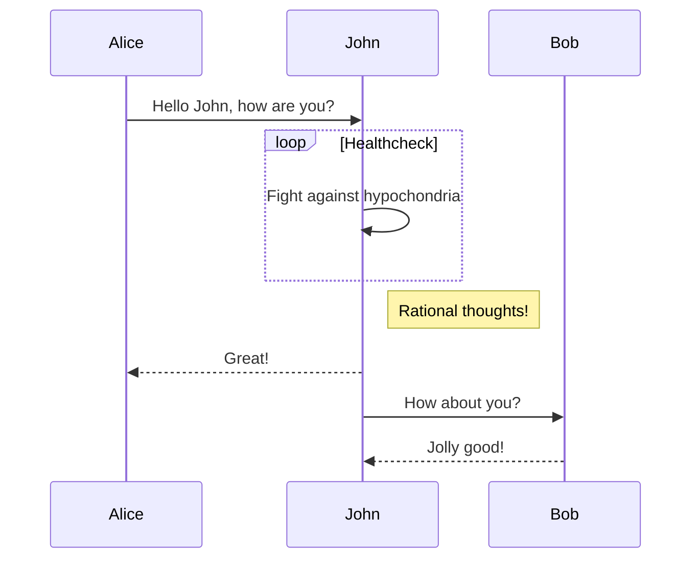
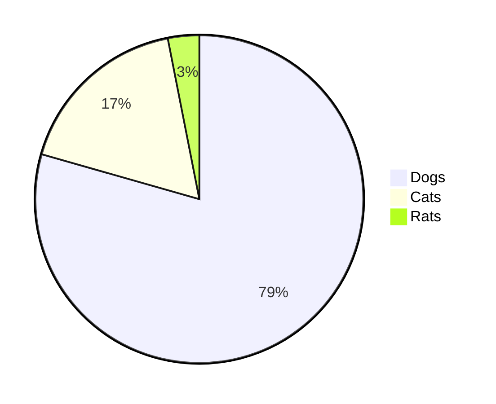

## はじめに

<https://github.com/haxibami/haxibami.net>

ブログを自作した。決め手は以下の四つ。

1. 適度な距離
1. メンテナンス性
1. 高速性・拡張性
1. 無広告

### 1. 適度な距離

あらゆるものが最適化されて提供される現代にあっては、遅配や誤配の確率はとても低い。大きなプラットフォームはユーザーの buzz をすすんで後押しし、かれに向けて、かれのために、とパーソナライズに躍起だ。書き手と読み手の距離は透明に、コミュニケーションは確実に。だがそうではない形式も（かつては？）あった。ひょっとしたら誰かに拾われるかもしれない、あるいはクローラにさえ拾われないかもしれない、そうした確率論的な雲のなかに自らの書いたものを打ち上げる。そして祈る。{古き良き日々}^(グッド・オールド・インターネッツ)は理想郷ではなかったにしても、あの誰かのものになる前の世界の、その歪な手触りを覚えておくための、この距離感。

### 2. メンテナンス性

先人たちが示してきたとおり、この手のサイトは管理・移行が億劫になった時点で**エタる**。放置された「〇〇の部屋」、消えて還らない借りもののドメイン、むなしく刻む入室カウンターたちを眺めるたびに、せめて記事くらいは慣れたファイル形式で楽に扱いたいと思うようになった。そういうわけで Markdown（コンテンツ） + tsx（テンプレート）。この組み合わせならそう簡単には廃れないだろうし、いつか別サービス・別フレームワークに移るときにもそれほど困らない（コンテンツが独立している限り）。

（2022/12/28 更新）

Markdown の処理系について。以前は`remark` + `rehype`の出力を`rehype-react` でレンダリングしていたが、`rehype-react`（厳密にいえばその依存先の`parse5`）のバンドルサイズがバカにならないので、`next-mdx-remote`に乗り換えた。

<https://github.com/hashicorp/next-mdx-remote>

これは名前の通り、Next.js で MDX / Markdown を処理するユーティリティで、Webpack loader を使う Next.js の[公式ガイド](https://nextjs.org/docs/advanced-features/using-mdx)とは異なり、`getStaticProps`経由でデータを取得する設計になっている。また内部では`remark` / `rehype`系の API が用いられており、これらの系列のプラグインが利用できる。

```ts title="lib/compile.ts"
import { serialize } from "next-mdx-remote/serialize";
import rehypeAutolinkHeadings from "rehype-autolink-headings";
import rehypeKatex from "rehype-katex";
import rehypePrettyCode from "rehype-pretty-code";
import rehypeRaw from "rehype-raw";
import rehypeSlug from "rehype-slug";
import remarkGemoji from "remark-gemoji";
import remarkGfm from "remark-gfm";
import remarkJaruby from "remark-jaruby";
import remarkMath from "remark-math";
import remarkUnwrapImages from "remark-unwrap-images";

import rehypeImageOpt from "./rehype-image-opt";
import { remarkLinkWidget, extLinkHandler } from "./remark-link-card";
import remarkMermaid from "./remark-mermaid";

import type { Options } from "rehype-pretty-code";

export const compileMdx = async (file: string) => {
  const rpcOptions: Partial<Options> = {
    theme: {
      dark: "rose-pine-moon",
    },
    onVisitLine(node) {
      if (node.children.length === 0) {
        node.children = [{ type: "text", value: " " }];
      }
    },
    onVisitHighlightedLine(node) {
      node.properties.className.push("highlighted");
    },
    onVisitHighlightedWord(node) {
      node.properties.className = ["word"];
    },
  };

  // compile md
  const mdxSource = await serialize(file, {
    mdxOptions: {
      remarkPlugins: [
        remarkGfm,
        remarkGemoji,
        remarkMath,
        remarkJaruby,
        remarkLinkWidget,
        remarkUnwrapImages,
        [
          remarkMermaid,
          {
            launchOptions: {
              args: ["--no-sandbox", "--disable-setuid-sandbox"],
            },
            wrap: true,
            className: ["mermaid"],
          },
        ],
      ],
      rehypePlugins: [
        rehypeSlug,
        [rehypeAutolinkHeadings, { behavior: "wrap" }],
        rehypeKatex,
        [rehypePrettyCode, rpcOptions],
        rehypeImageOpt,
        rehypeRaw,
      ],
      remarkRehypeOptions: {
        handlers: {
          extlink: extLinkHandler,
        },
      },
      format: "md",
      development: false,
    },
    parseFrontmatter: true,
  });

  return mdxSource;
};
```

[開発背景](https://github.com/hashicorp/next-mdx-remote#background--theory)に記載があるように、バンドルサイズの削減にも注意が払われているらしく、実際に私の環境では（`rehype-react`比で）200KB ほどバンドルが小さくなった。


### 3. 高速性・拡張性

Next.js。

個人サイトには若干過剰の感もある。ただページ遷移がやっぱり気持ちいいし、Vercel なら画像の最適化も効くし……こうしてベンダーロックインへと突き進んでゆくのでした。あと少々複雑なことをしようとしてもフレームワークの守備範囲をはみ出さないのは良い。

### 4. 広告や統計の排除

過剰な広告・統計に対して憎悪を抱いているため、このサイトには一切設置していない。唯一、このサイトのホスト先である Vercel が行っているアナリティクスだけは確認している。[こちらの記事](/blog/posts/nextdns-install)も参照。

## 機能一覧と実装

以下はこのブログの機能・実装のギャラリー。

### 記事メタデータ

Markdown 内の frontmatter からデータを取得。また`strip-markdown`で本文を plain text 化し、冒頭を抽出したものを各記事のプレビューとして流している。

<https://github.com/remarkjs/remark-frontmatter>

<https://github.com/vfile/vfile-matter>

<https://github.com/remarkjs/strip-markdown>

```md
---
slug: "blog-renewal"
title: "Next.jsでブログをつくった"
date: "20220326"
tags: ["tech", "web", "nextjs"]
---
```

### GitHub Flavored Markdown

<https://github.com/remarkjs/remark-gfm>

```md
| 表を     | 作る       |
| -------- | ---------- |
| たとえば | このように |
| 要素を   | 増やす     |

<https://www.haxibami.net>

みたいな生のリンクも置けるし

- こうやって
  - リストが書ける。

ほかにも、

- [x] TODO
- [ ] リストや、[^1]

[^1]: 脚注も使える
```

| 表を     | 作る       |
| -------- | ---------- |
| たとえば | このように |
| 要素を   | 増やす     |

<https://www.haxibami.net>

みたいな生のリンクも置けるし

- こうやって
  - リストが書ける。

ほかにも、

- [x] TODO
- [ ] リスト
- [ ] や、[^1]

[^1]: 脚注も使える

### 絵文字

<https://github.com/remarkjs/remark-gemoji>

`:v:`が :v: に。

### 数式

<https://github.com/remarkjs/remark-math>

<https://github.com/remarkjs/remark-math/tree/main/packages/rehype-katex>

適当なところで KaTeX のスタイルシートを読み込む必要がある（忘れがち）。

```md
> $$
> ( \sum_{k=1}^{n} a_k b_k )^2 \leq ( \sum_{k=1}^{n} {a_k}^2 ) ( \sum_{k=1}^{n} {b_k}^2 )
> $$
```

> $$
> ( \sum_{k=1}^{n} a_k b_k )^2 \leq ( \sum_{k=1}^{n} {a_k}^2 ) ( \sum_{k=1}^{n} {b_k}^2 )
> $$

```md
> $e^{i\pi} + 1 = 0$ :arrow_left: インライン数式
```

$e^{i\pi} + 1 = 0$ :arrow_left: インライン数式

### ルビ

やや古い既存のパッケージ（`remark-ruby`）をフォークして、別パッケージ（`remark-jaruby`）を実装。

<https://github.com/haxibami/remark-jaruby>

```md
> 昨日午後、{†聖剣†}^(エクスカリバー)を振り回す{全裸中年男性}^(無敵の人)が出現し……
```

> 昨日午後、{†聖剣†}^(エクスカリバー)を振り回す{全裸中年男性}^(無敵の人)が出現し……

### ページ内リンク

<https://github.com/rehypejs/rehype-slug>

<https://github.com/rehypejs/rehype-autolink-headings>

:arrow_right: [はじめに](#はじめに) に飛べるよ

### Mermaid Diagram

[remark-mermaidjs](https://github.com/remcohaszing/remark-mermaidjs)をベースに remark プラグインを書いた。ビルド時にヘッドレス Chromium 上で SVG を描画させてから取り出している（わざわざ？　の感もあるが仕方ない[^2]）。サイト内に JS を設置してユーザー側で動的にレンダリングさせることもできるが、事前に変換できたほうが（SSG としては）嬉しい。

[^2]: 調べた & 試した限り、mermaid は node 上の DOM ライブラリ（JSDOM や happy-dom）では動かない

```ts title="lib/remark-mermaid.ts"
...

const remarkMermaid: Plugin<[RemarkMermaidOptions?]> = function mermaidTrans(
  options
): Transformer {
  const DEFAULT_SETTINGS = {
    launchOptions: {
      args: ["--no-sandbox", "--disable-setuid-sandbox"],
    },
    theme: "default",
    wrap: false,
    classname: [],
  };

  const settings = Object.assign({}, DEFAULT_SETTINGS, options);

  // eslint-disable-next-line @typescript-eslint/no-unused-vars
  return async (node: Node, _file: VFileCompatible) => {
    const mermaidBlocks = getMermaidBlocks(node);
    if (mermaidBlocks.length === 0) {
      return;
    }
    const browser = await playwright.chromium.launch(settings.launchOptions);
    const context = await browser.newContext({
      viewport: { width: 1000, height: 3000 },
    });
    const page = await context.newPage();
    await page.setContent(`<!DOCTYPE html>`);
    await page.addScriptTag({
      url: "https://unpkg.com/mermaid/dist/mermaid.min.js",
      type: "module",
    });
    // await page.setViewportSize({ width: 1000, height: 3000 });
    const svgResults = await page.evaluate(
      ({ blocks, theme }) => {
        const config: MermaidConfig = {
          theme: theme,
          startOnLoad: false,
        };
        mermaid.mermaidAPI.initialize(config);
        return blocks.map(([code, ,], id) => {
          const svg = mermaid.mermaidAPI.render(`mermaid-${id}`, code.value);
          return svg;
        });
      },
      { blocks: mermaidBlocks, theme: settings.theme }
    );
    await browser.close();

    mermaidBlocks.forEach(([, index, parent], i) => {
      const svgAst = svgParse(optSvg(svgResults[i]));
      if (settings.wrap) {
        parent.children[index] = {
          type: "parent",
          children: [],
          data: {
            hChildren: [
              {
                type: "element",
                children: [svgAst],
                tagName: "div",
                properties: {
                  className: settings.classname,
                },
              },
            ],
          },
        } as Parent;
      } else {
        parent.children[index] = {
          type: "paragraph",
          children: [],
          data: {
            hChildren: [svgAst],
          },
        } as Paragraph;
      }
    });
  };
};

function getMermaidBlocks(node: Node): MermaidBlock[] {
  const blocks: MermaidBlock[] = [];

  visit(
    node,
    isMermaid,
    (node: Code, index: number, parent: Parent | undefined) => {
      if (!isParent(parent)) {
        return;
      }
      blocks.push([node, index, parent]);
    }
  );

  return blocks;
}

...
```

````md



````


### シンタックスハイライト

`rehype-pretty-code`を採用。このプラグインの内部処理には[shiki](https://shiki.matsu.io)が使われており、コード解析とスタイル適用がビルド時に済む（追加 CSS が不要）、VSCode のカラースキームが使える、などの利点がある。

<https://github.com/atomiks/rehype-pretty-code>

<https://github.com/shikijs/shiki>

### リンクカード

:arrow_down: このもこっとしたカード

<https://zenn.dev/tomi/articles/2021-03-22-blog-card>

<https://zenn.dev/januswel/articles/745787422d425b01e0c1>

上の記事を参考に、unified の Transformer プラグインとして実装した。文書中に単独で貼られたリンク（`Paragraph`ノードかつ、子要素が単一の`Link`ノードであるもの）を適当な独自ノード（`<extlink>`）に置き換え、リンク先にアクセスして得たメタ情報（title、description、OG image URL）を付加している。この一式を`<MDXRemote>`の`components`オプションを使って自作コンポーネントに変換することで、好きなスタイルで画像付きリンクカードが表示できる。

```ts title="lib/remark-link-card.ts"
import getMetadata from "metadata-scraper";
import { visit } from "unist-util-visit";

import { isParent, isLink, isParagraph } from "./mdast-util-node-is";

import type { Paragraph, Link, Literal } from "mdast";
import type { H } from "mdast-util-to-hast";
import type { Plugin, Transformer } from "unified";
import type { Node, Parent } from "unist";
import type { VFileCompatible } from "vfile";

interface ExtLink extends Literal {
  type: "extlink";
  meta: {
    url: string;
    title: string;
    description: string;
    og: string;
    icon: string;
  };
}

function isExtLink(node: unknown): node is Paragraph {
  if (!isParagraph(node)) {
    return false;
  }

  const { children } = node;

  if (children.length != 1) {
    return false;
  }

  const singleChild = children[0];
  if (
    !(
      isLink(singleChild) &&
      singleChild.children[0].type == "text" &&
      singleChild.url.startsWith("http")
    )
  ) {
    return false;
  }

  return true;
}

function fetchMeta(url: string) {
  const metas = getMetadata(url).then((data) => {
    const metaData = {
      url: url,
      title: data.title ?? "",
      description: data.description ?? "",
      og: data.image ?? "",
      icon: data.icon ?? "",
    };
    return metaData;
  });
  return metas;
}

export const remarkLinkWidget: Plugin = function extLinkTrans(): Transformer {
  // eslint-disable-next-line @typescript-eslint/no-unused-vars
  return async (tree: Node, _file: VFileCompatible) => {
    const promises: (() => Promise<void>)[] = [];
    visit(tree, isExtLink, visitor);
    await Promise.all(promises.map((t) => t()));

    function visitor(
      node: Paragraph,
      index: number,
      parent: Parent | undefined
    ) {
      if (!isParent(parent)) {
        return;
      }

      if (parent.type === "listItem") {
        return;
      }

      const child = node.children[0] as Link;

      promises.push(async () => {
        const data = await fetchMeta(child.url);
        parent.children[index] = {
          type: "extlink",
          meta: data,
        } as ExtLink;
      });
    }
  };
};

export function extLinkHandler(_h: H, node: ExtLink) {
  return {
    type: "element" as const,
    tagName: "extlink",
    properties: {
      url: node.meta.url,
      title: node.meta.title,
      description: node.meta.description,
      og: node.meta.og,
      icon: node.meta.icon,
    },
    children: [],
  };
}
```

取得したメタデータは 以下のように props 経由で受け渡しできる。型の扱いが雑だけど……ヨシ！（炎上）

```tsx title="components/MdxComponent/index.tsx" /props/
import LinkWidget from "components/LinkWidget";
import MyLink from "components/MyLink";
import NextImage from "components/NextImage";

import type { LinkWidgetProps } from "components/LinkWidget";
import type { MyLinkProps } from "components/MyLink";
import type { NextImageProps } from "components/NextImage";
import type { MDXComponents } from "mdx/types";

type ProvidedComponents = MDXComponents & {
  a?: typeof MyLink;
  img?: typeof NextImage;
  extlink?: typeof LinkWidget;
};

const components = {
  a: (props: MyLinkProps) => <MyLink {...props} />,
  img: (props: NextImageProps) => <NextImage {...props} />,
  extlink: (props: LinkWidgetProps) => <LinkWidget {...props} />,
} as ProvidedComponents;

export default components;
```

なお、プラグイン内部で`fetch`を行っている都合上、作成したプラグイン全体が非同期となることに留意。具体的には unified で`processSync`が[使えなくなる](https://github.com/unifiedjs/unified#processorprocesssyncfile)。

### 画像処理

Markdown で挿入した画像はそのままでは通常の``タグに変換され、Next.js の画像最適化の対象にならないが、これも[リンクカード](#リンクカード)と同様の手順で`next/image`に置換することで解決できる。

```tsx title="components/NextImage.tsx"
import React from "react";

import Image from "next/image";
import Link from "next/link";

import Styles from "./style.module.scss";

export type NextImageProps = {
  src: string;
  alt?: string;
  aspectRatio: string;
  blurDataURL: string;
};

const NextImage: React.FC<NextImageProps> = (props) => {
  const { src, alt, aspectRatio, blurDataURL } = props;
  return alt !== "asciicast" ? (
    <figure className={Styles.Figure}>
      <Link href={src} scroll={false}>
        <div className={Styles.ImgBox} style={{ aspectRatio: aspectRatio }}>
          <Image
            className={Styles.Img}
            src={src}
            alt={alt || src}
            fill={true}
            placeholder="blur"
            blurDataURL={blurDataURL}
          />
        </div>
      </Link>
      <figcaption>{alt}</figcaption>
    </figure>
  ) : (
    <div className={Styles.ImgBox}>
      <Image className={Styles.Img} src={src} alt={alt} fill={true} />
    </div>
  );
};

export default NextImage;
```

```ts title="lib/rehype-image-opt.ts"
import { getPlaiceholder } from "plaiceholder";
import { visit } from "unist-util-visit";

import type { Element } from "hast";
import type { Node } from "unist";
import type { VFileCompatible } from "vfile";

export default function rehypeImageOpt() {
  return async (tree: Node, _file: VFileCompatible) => {
    const promises: (() => Promise<void>)[] = [];
    visit(tree, "element", (node: Element) => {
      if (
        node.tagName === "img" &&
        node.properties &&
        node.properties.src &&
        typeof node.properties.src === "string"
      ) {
        const src = node.properties.src;

        promises.push(async () => {
          if (node.properties) {
            const blur = await getPlaiceholder(src);
            node.properties.src = blur.img.src;
            node.properties.width = blur.img.width;
            node.properties.height = blur.img.height;
            node.properties.aspectRatio = `${blur.img.width} / ${blur.img.height}`;
            node.properties.blurDataURL = blur.base64;
          }
        });
      }
    });
    await Promise.all(promises.map((t) => t()));
  };
}
```

上の例では変換処理に加えて、画像のサイズ取得・プレースホルダー生成を行う rehype プラグインを実装し、

- 画像読み込み前のプレースホルダーの設定
- 画像を収納する親要素のサイズ調整（画像のアスペクト比を利用）

などを行っている。

参考：

<https://zenn.dev/elpnt/articles/c17727e9d254ef00ea60>

<https://nextjs.org/docs/api-reference/next/image#blurdataurl>

### ダークモード

外部ライブラリを使用。

<https://github.com/pacocoursey/next-themes>

### OGP 画像の生成

（2022/12/28 更新）

ヘッドレス Chromium を使った古い実装から、Vercel 公式が提供する[新しいアプローチ](https://vercel.com/docs/concepts/functions/edge-functions/og-image-generation)（`@vercel/og`）に乗り換えた。どうやら[yoga-layout](https://yogalayout.com/)のスタイリングエンジンを WASM で動かしているらしく、かなり速い。しかも Tailwind が使える。

```tsx title="pages/api/ogp.tsx"
import type { NextRequest } from "next/server";

import { ImageResponse } from "@vercel/og";

export const config = {
  runtime: "experimental-edge",
};

const handler = async (req: NextRequest) => {
  try {
    const { searchParams } = new URL(req.url);
    const title = searchParams.has("title")
      ? searchParams.get("title")?.slice(0, 80)
      : "";
    const date = searchParams.has("date")
      ? `📅 ― ${searchParams.get("date")?.slice(0, 8)}`
      : "";

    // CJK font is so large that if placed locally it easily exceeds the 1MB Edge Function limit >_<
    const notoFontData = await fetch(
      "https://rawcdn.githack.com/haxibami/Noto-Sans-CJK-JP/master/fonts/NotoSansCJKjp-Bold.woff"
    ).then((res) => res.arrayBuffer());

    const robotoFontData = await fetch(
      new URL("../../assets/RobotoMono-Medium.woff", import.meta.url)
    ).then((res) => res.arrayBuffer());

    const pngIcon = new URL(
      "../../assets/icon_ange_glasses_192.png",
      import.meta.url
    ).toString();

    return new ImageResponse(
      (
        <div
          style={{
            height: "100%",
            width: "100%",
            display: "flex",
            flexDirection: "column",
            alignItems: "center",
            justifyContent: "center",
            padding: "30px",
            fontFamily: "Noto Sans CJK JP",
            backgroundColor: "#171726",
            color: "#f2f0e6",
          }}
        >
          <div tw="flex flex-col p-12 w-full h-full border-solid border-4 border-white rounded-xl">
            <div tw="flex flex-1 max-w-full items-center max-h-full">
              <h1 tw="text-6xl leading-tight max-w-full">
                <p tw="w-full justify-center">{title}</p>
              </h1>
            </div>
            <div tw="flex flex-row justify-between items-center w-full">
              <div tw="flex items-center">
                {/* eslint-disable-next-line @next/next/no-img-element */}
                
                <h2 tw="text-4xl mr-5">
                  <p
                    style={{
                      fontFamily: "Roboto Mono",
                    }}
                  >
                    haxibami.net
                  </p>
                </h2>
              </div>
              <div tw="flex">
                <h2 tw="text-4xl">
                  <p>{date}</p>
                </h2>
              </div>
            </div>
          </div>
        </div>
      ),
      {
        fonts: [
          {
            name: "Noto Sans CJK JP",
            data: notoFontData,
            weight: 700,
            style: "normal",
          },
          {
            name: "Roboto Mono",
            data: robotoFontData,
            weight: 500,
            style: "normal",
          },
        ],
      }
    );
  } catch (e) {
    console.log(`${e}`);
    return new Response(`Failed to generate the image`, {
      status: 500,
    });
  }
};

export default handler;
```

ちなみにこの関数は Edge 環境で実行されるため、総容量制限は **1MB** とかなり厳しい。日本語フォントは内蔵のもの（Noto Sans JP？）で妥協するか、サブセット化したものを Web フォントとしてロードするしかない。

### サイトマップ生成

frontmatter に記載した記事情報に合わせてサイトマップを生成したかったので、[このへん](https://www.mk-engineer.com/posts/nextjs-before-build)を参考にしつつ自分で書いた。npm scripts を活用し、

1. ビルド前に記事のインデックスをキャッシュ
1. キャッシュに基づいて`public/sitemap.xml`と`public/robots.txt`を生成

するようにしてある。

```js title="hooks/scripts/sitemap.mts"
import fs from "fs";

import { globby } from "globby";
import prettier from "prettier";

import { dateConverter } from "./lib/build.js";
import { HOST } from "./lib/constant.js";

import type { PostData } from "./lib/interface.js";

// variables
const XMLFILE = "sitemap.xml";

// Article index file
const postIndexFile = fs.readFileSync("src/share/index.json", "utf-8");
const postIndex = JSON.parse(postIndexFile);

// format xml
const formatXml = (sitemap: string) =>
  prettier.format(sitemap, { parser: "html" });

// generate sitemap & robots.txt
const sitemapGenerator = async () => {
  const solidPaths = await globby(["src/pages/*.tsx", "src/pages/blog/*.tsx"], {
    ignore: [
      "src/pages/_*.tsx",
      "src/pages/404.tsx",
      "src/pages/grad_essay.tsx",
    ],
  });

  const solidPageInfos = solidPaths.map((filePath) => {
    const solidPageInfo = {
      relpath: filePath
        .replace("src/pages/", "")
        .replace(".tsx", "")
        .replace("index", ""),
      lastmod: new Date().toISOString(),
    };
    return solidPageInfo;
  });

  const blogposts = postIndex.articles.blog;

  const blogInfos = blogposts.map((post: PostData) => {
    const blogInfo = {
      relpath: `blog/posts/${post.data?.slug}`,
      lastmod: dateConverter(post.data?.date),
    };
    return blogInfo;
  });

  const sitemapInfos = solidPageInfos.concat(blogInfos);

  const pagesSitemap = `

  ${sitemapInfos
    .map((info) => {
      return `
        <url>
          <loc>https://${HOST}/${info.relpath}</loc>
          <lastmod>${info.lastmod}</lastmod>
        </url>
      `;
    })
    .join("")}
  `;

  const generatedSitemap = `
<?xml version="1.0" encoding="UTF-8"?>
<urlset
  xmlns="http://www.sitemaps.org/schemas/sitemap/0.9"
  xmlns:xsi="http://www.w3.org/2001/XMLSchema-instance"
  xsi:schemaLocation="http://www.sitemaps.org/schemas/sitemap/0.9 http://www.sitemaps.org/schemas/sitemap/0.9/sitemap.xsd"
>
  ${pagesSitemap}
</urlset>
  `;

  const robots = `# *
User-agent: *
Allow: /

# Host
Host: https://www.haxibami.net

# Sitemaps
Sitemap: https://www.haxibami.net/sitemap.xml
`;

  fs.writeFileSync(`public/${XMLFILE}`, formatXml(generatedSitemap));
  fs.writeFileSync("public/robots.txt", robots);
};

const genSitemap = () => {
  return new Promise<void>((resolve) => {
    sitemapGenerator();
    resolve();
  });
};

export default genSitemap;
```

### フィード対応

`Feed`というライブラリで形式を整え、サイトマップと同じ要領でビルド時に RSS、Atom、JSON Feed 用のファイルを吐かせている。

<https://github.com/jpmonette/feed>

```js title="hooks/scripts/feed.mts"
import fs from "fs";

import { Feed } from "feed";

import { dateConverter } from "./lib/build.js";
import { SITEDATA } from "./lib/constant.js";
import { getPostsData } from "./lib/fs.js";

// variables
const HOST = "https://www.haxibami.net";

// generate feed
const feedGenerator = async () => {
  const author = {
    name: "haxibami",
    email: "contact@haxibami.net",
    link: HOST,
  };

  const date = new Date();
  const feed = new Feed({
    title: SITEDATA.blog.title,
    description: SITEDATA.blog.description,
    id: HOST,
    link: HOST,
    language: "ja",
    image: `${HOST}/icon_ange_glasses_192.png`,
    favicon: `${HOST}/favicon.ico`,
    copyright: `All rights reserved ${date.getFullYear()}, ${author.name}`,
    updated: date,
    feedLinks: {
      rss2: `${HOST}/rss/feed.xml`,
      json: `${HOST}/rss/feed.json`,
      atom: `${HOST}/rss/atom.xml`,
    },
    author: author,
  });

  const blogs = await getPostsData("articles/blog");

  blogs.forEach((post) => {
    const url = `${HOST}/blog/posts/${post.data?.slug}`;
    feed.addItem({
      title: `${post.data?.title}`,
      description: `${post.preview}`,
      id: url,
      link: url,
      date: new Date(dateConverter(post.data?.date)),
    });
  });

  fs.mkdirSync("public/rss", { recursive: true });
  await Promise.all([
    fs.promises.writeFile("public/rss/feed.xml", feed.rss2()),
    fs.promises.writeFile("public/rss/atom.xml", feed.atom1()),
    fs.promises.writeFile("public/rss/feed.json", feed.json1()),
  ]);
};

const GenFeed = () => {
  return new Promise<void>((resolve) => {
    feedGenerator();
    resolve();
  });
};

export default GenFeed;
```

## 感想

~~時間をドブに捨てた~~地道な改修の結果、はてなブログや Qiita、Zenn あたりに負けない書き心地になってきた。ちなみに肝心の記事は全然増えていない。
