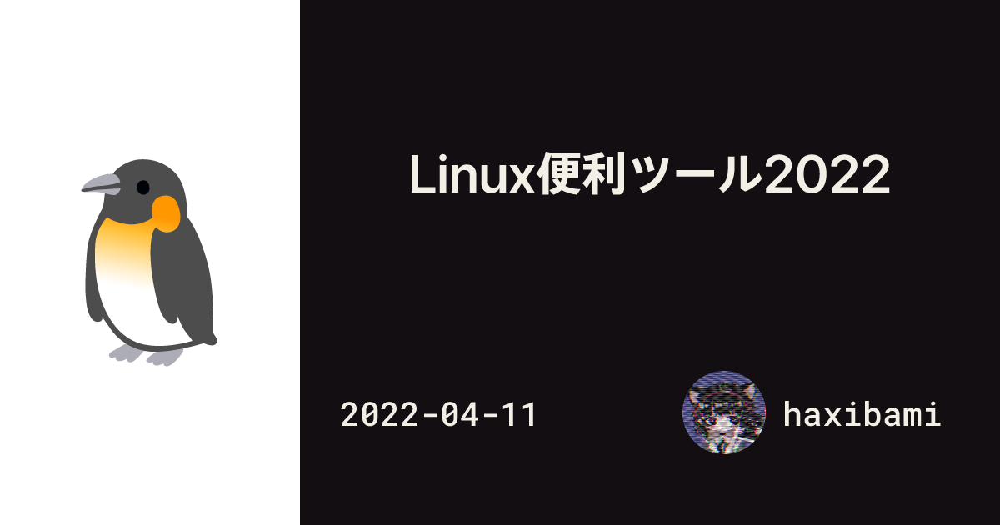

（2024/07/07 追記）いくつかの実装を[更新](/blog/posts/blog-astro-2024)した

## 概要

1年半ほど[Next.js](https://nextjs.org/)で運用してきたサイトを[Astro](https://astro.build)で書き直した。

## 実装のポイント

### Freeze everything :snowflake:

検索していて、あるサイトに出会った。フロントエンドの技術を調べていたときだった。サイトの概要文にはいくつかのキーワードが書かれていた——「（あるモダンなフレームワークの名前）」、「静的サイト生成」、云々、云々。とっても素晴らしい。期待してアクセスした。

ページに入ると、はじめにブラウザのデフォルトのフォントでレンダリングがおこなわれた。見たところこのサイトは、余分な装飾も少なく、比較的**ミニマル**らしい。そう思ったとたん、画面がフラッシュし、スタイリッシュな字体がドカッと降ってきた。Web フォントのお出ましだ。息つく間もなく、確定済みのレイアウトを押しのけて外部の画像が割り込んでくる。同時に、埋め込まれていた`<iframe>`が正体を現し、なにやらスクリプトもガチャガチャとロードされた。この間およそ数秒。

いったい何が起こったのか？

答え：たとえ静的生成されたサイトであっても、すべてのリソースがビルド時に解決されるわけではない。[Google Fonts](https://fonts.google.com/)用のスタイルシートや、外部の画像への参照、`<iframe>`による外部コンテンツの呼び出し……こうしたリソースの解決はしばしばクライアント側に委ねられ、（よほどひどい場合）上のような事態をもたらす。逆にいえば、もし静的サイトをさらにチューニングするのなら、このあたりには改善の余地がある。単純な話だ。とにかく、可能な限りのものをビルド時に**凍結**して、バンドルに含めてしまえばよい。ここで重要な真理をひとつ——たいていの場合、なにごとも決定済みであるほうが喜ばしい。

#### 1. リンクカード内の画像

（2024/07/07 追記）最新の実装は[こちら](/blog/posts/blog-astro-2024#リンクカード内の画像の取り扱い変更)を参照

[以前の実装](/blog/posts/blog-renewal)以来、Markdown内の単独のリンクはリンクカード（:point_down: こういうの）に変換され、リンク先のOpen Graph（以下、OG）画像などが表示されるようになっていた。

https://ogp.me/

この画像は外部のものをそのままリンクしていたので、[Lighthouse](https://developer.chrome.com/ja/docs/lighthouse/)のパフォーマンス診断をかけると、サイズがデカすぎるから減らせと怒鳴られることがあった。そこで、画像をいったん取得し、[sharp](https://sharp.pixelplumbing.com/)で適正なサイズに縮小（ついでに`.webp`に変換）して`base64`形式でドキュメントに埋め込んだ。これでクライアント側でのリクエストが減り、総転送量自体も抑えられる。

代償として、1. ドキュメント自体のサイズが増え、2. ビルド時間がやや長くなる ところだが、さいわいこの記事数・リンク数ではそれほどの影響はなかった。さらにいえば画像の取得結果は（開発サーバ内で）軽くキャッシュされる実装になっているので、一度アクセスすれば（少なくとも開発サーバのセッション内では）応答速度も悪くない。

#### 2. OG画像の生成

こちらから提供する OG画像についても、Edge Functionで動的に応答させる方式を改め、ビルド時に生成することとした。Astroが提供する静的ファイルのエンドポイントを作成する機能を使い、記事一覧から勝手に画像が生えてくるようにしている。

https://docs.astro.build/ja/guides/endpoints/

#### 3. `@fontsource-variable` の活用

WebフォントをNPMパッケージから`import`することで、サイトと一緒くたにバンドルし、同じサーバから配信できる、という[便利なツール](https://fontsource.org/)がある。せっかくなので[バリアブルフォント](https://developer.mozilla.org/ja/docs/Web/CSS/CSS_fonts/Variable_fonts_guide)を使ってみた。軽量で便利なのではやく普及してほしい。

### 画像処理のワークフロー :factory:

（2024/07/07 追記）最新の実装は[こちら](/blog/posts/blog-astro-2024#画像処理の簡素化レスポンシブ対応)を参照

Astro v3では、Markdown / MDX内の画像を最適化する[いくつかの方法](https://docs.astro.build/ja/guides/images/)が公式に提供されている。しかしながら、それらはみな

1. 「MDXやAstroコンポーネントの内部で**個別に画像をインポート**し / `<Image>`コンポーネントに代入して処理をカスタマイズする」
2. 「通常のMarkdownの記法で画像を挿入し / Astro側が自動で行う処理に甘んじる」

のいずれかであって、 3. 「Markdownの記法で挿入し / `<Image>`コンポーネントでカスタマイズ」したい私の願いとは相容れなかった。そのため、Markdownの処理時に``要素を`<Image>`コンポーネントに[置き換える](https://docs.astro.build/ja/guides/markdown-content/#%E3%82%AB%E3%82%B9%E3%82%BF%E3%83%A0%E3%82%B3%E3%83%B3%E3%83%9D%E3%83%BC%E3%83%8D%E3%83%B3%E3%83%88%E3%82%92html%E8%A6%81%E7%B4%A0%E3%81%AB%E5%89%B2%E3%82%8A%E5%BD%93%E3%81%A6%E3%82%8B)方法で対応した。

注意点としては、

- コンポーネントの置き換えを使うには、たとえファイル名だけでも `.mdx`にしなければならない（Plain Markdownでは不可能）
- 最終的に画像もViteのバンドルに含められる関係上、`<Image>`内の画像は必ずどこかでインポートしたものでなければならない

などがある。後者については、個別の画像ごとではなく、`import.meta.glob()`を使ってフォルダ内の画像をまるごとインポートしてしまうことで対処した。

### スタイル面・その他 :sparkles:

スタイルは大きくは変えていないが、ちょっと「洗練」が入った（要検証）。あとリセットCSS (`preflight.css`) のみを残し、Tailwindを剥がした。

ホスト先はVercel + Cloudflareの二重構成をやめ、Cloudflare Pagesにがっちり腰を据えた。

## 総評

全体的に開発体験が良くなった。[コンテンツコレクション](https://docs.astro.build/ja/guides/content-collections/)のおかげでMarkdown / MDXに型が付くし、Viteベースのモダンなエコシステムでやっていけるのは嬉しい。

パフォーマンスは以前の実装でも十分すぎるほどだったが、今回の改修で全体の転送量がかなり減り、さらに良くなった（はず）。

~~ところで記事のほうは何か増やされたんですか？~~
