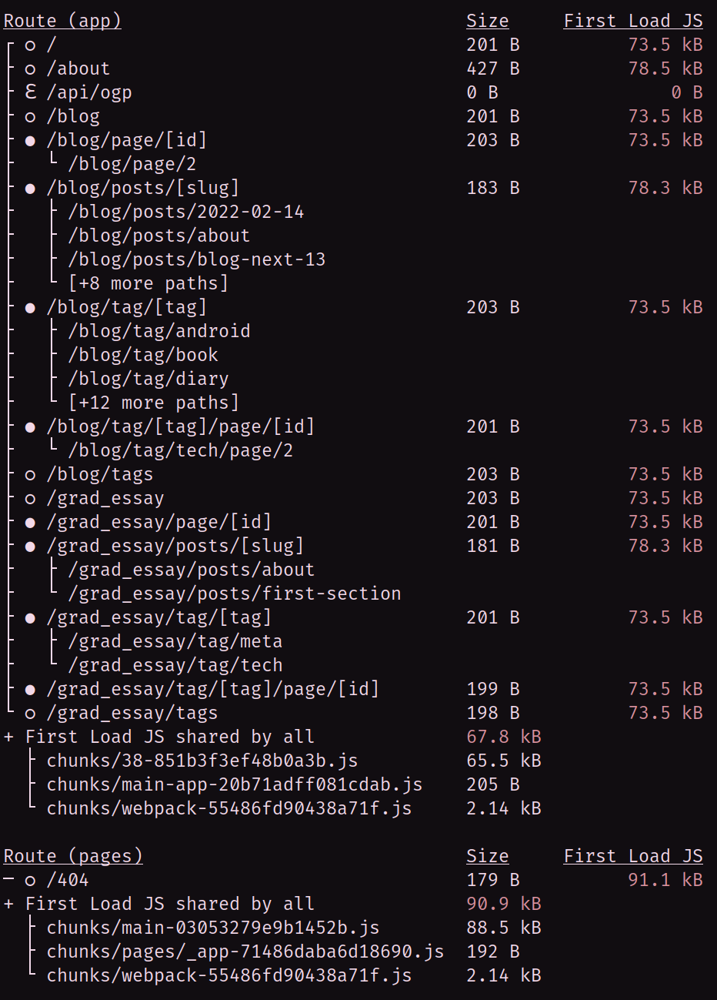
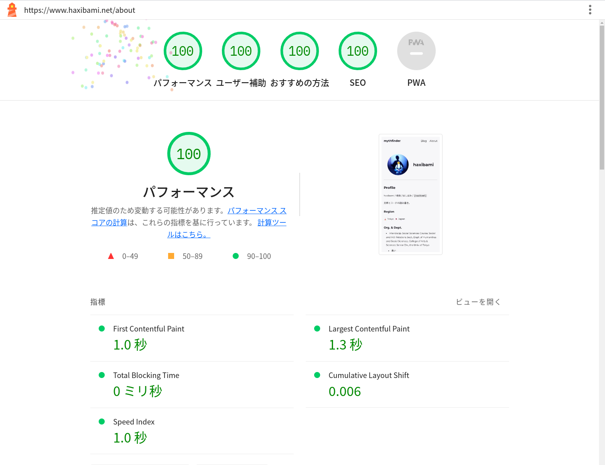

（2023/10/05 追記）Astroで[書き直した](/blog/posts/blog-astro-renewal)

## はじめに

:tada: Next.js 13.2がリリースされ、App Router (beta) & React Server Component（以下RSC）が実用できそうな感じになってきたため、このサイトでも移行した。Metadata API、Route Handler等も同時に導入した。

## やったこと

（一般的な設定については[ドキュメント](https://nextjs.org/docs/app)等を参照）

### next.config.js

```js title="next.config.mjs" {5-11}
/** @type {import('next').NextConfig} */
let nextConfig = {
  reactStrictMode: true,
  experimental: {
    serverComponentsExternalPackages: [
      "playwright",
      "svgo",
      "plaiceholder",
      "@plaiceholder/next",
      "fetch-site-metadata",
    ],
    scrollRestoration: true,
    appDir: true,
  },
  images: {
    formats: ["image/avif", "image/webp"],
    domains: ["asciinema.org", "raw.githubusercontent.com"],
  },
};
```

[`experimental.serverComponentsExternalPackages`](https://nextjs.org/docs/app/api-reference/next-config-js/serverExternalPackages)という項目がけっこう重要。Markdownの処理にNode.jsのライブラリを使用している場合、該当ライブラリをここに列挙する必要がある。

あと関係ないが`next.config.js`はドシドシESM（`.mjs`）で書こう。

### Markdown / MDXの処理

[公式ブログ](https://nextjs.org/blog/next-13-2)を見る限り、`@next/mdx`、`next-mdx-remote`、`contentlayer`の三者は現時点（2023/03/03）でRSCに対応している。

[https://github.com/hashicorp/next-mdx-remote](https://github.com/hashicorp/next-mdx-remote)

[https://contentlayer.dev](https://contentlayer.dev)

`next-mdx-remote/rsc`を使ったところ、入出力の仕様が微妙に変更されていて戸惑った。`compileMDX`でJSXを直接吐かせるか、`<MDXRemote>`コンポーネントにMarkdown / MDXを食わせるか選べるようだ（おそらくどちらでも出力に差はない）。

そのほか、`frontmatter`に型を付けられるようになった。

```ts title="lib/compiler.ts" {8-14}
import { compileMDX } from "next-mdx-remote/rsc";
...
import MDXComponent from "components/MDXComponent";
...
const compiler = async (source: string) => {
  const result: Promise<{
    content: JSX.Element;
    frontmatter: {
      slug: string;
      title: string;
      date: string;
      description: string;
      tags: string[];
    };
  }> = compileMDX({
    source,
    components: MDXComponent,
    options: {
      ...
    },
  });
  return result;
};

export default compiler;
```

### Route HandlerによるOpen Graph（OG）画像生成

Next.js 13.2で従来のAPI Routesを代替するRoute Handlerが登場したため、ついに[OG 画像生成](/blog/posts/blog-renewal#og-画像の生成)で使っていた`pages`ディレクトリを完全に廃止[^1]できるようになった。

[^1]: 厳密には`404.js`がまだ残っているが、こちらで書かなくても処理されるので`pages`ディレクトリ自体は削除可能

[https://nextjs.org/docs/app/building-your-application/routing/route-handlers](https://nextjs.org/docs/app/building-your-application/routing/route-handlers)

### Metadata API

同じくNext.js 13.2で登場。サイトマップの生成に使った。

```ts title="src/app/sitemap.ts"
import type { MetadataRoute } from "next";

import { globby } from "globby";

import { dateConverter } from "lib/build";
import { HOST } from "lib/constant";
// Article index file
import postIndex from "share/index.json";

import type { PostData } from "lib/interface";

export default async function sitemap(): Promise<MetadataRoute.Sitemap> {
  const constPaths = await globby(["src/app/**/page.tsx", "src/app/page.tsx"], {
    ignore: ["src/app/api/*.tsx", "src/app/grad_essay/**", "src/app/**/[*/**"],
  });

  const constPageEntries = constPaths.map((filePath) => {
    const constPageEntry = {
      relpath: filePath.replace("src/app/", "").replace("page.tsx", ""),
      lastmod: "",
    };
    return constPageEntry;
  });

  const blogposts = postIndex.articles.blog;

  const blogTags = postIndex.tags.blog;

  const blogEntries = blogposts.map((post: PostData) => {
    const blogEntry = {
      relpath: `blog/posts/${post.data?.slug}`,
      lastmod: dateConverter(post.data?.date),
    };
    return blogEntry;
  });

  const blogTagEntries = blogTags.map((tag: string) => {
    const blogTagEntry = {
      relpath: `blog/tag/${tag}`,
      lastmod: "",
    };
    return blogTagEntry;
  });

  const sitemapEntries = constPageEntries.concat(blogEntries, blogTagEntries);
  return sitemapEntries.map((entry) =>
    entry.lastmod !== ""
      ? {
          url: `https://${HOST}/${entry.relpath}`,
          lastModified: entry.lastmod,
        }
      : {
          url: `https://${HOST}/${entry.relpath}`,
        },
  );
}
```

## 所感

もともと完全な静的サイトなので、実のところそれほどパフォーマンスに変化はない。バンドルサイズは多少小さくなったかもしれないが。



ちなみにLighthouseのスコアはこんな感じ：





