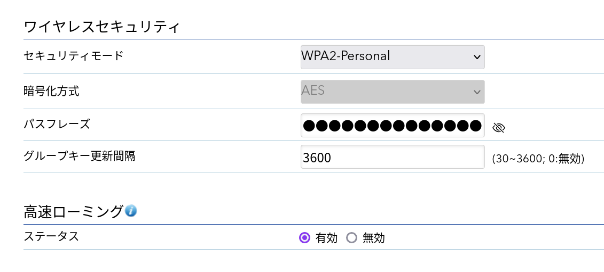

## はじめに

かつては我が家も「Wi-Fiルーター [^1]」を使っていた。いまはもう懐かしい[^2]、黒地に赤い線が入った某社の機器を別のルータの配下にぶら下げて、ブリッジモードで動かしていた[^3]のを覚えている。欠陥があるというわけではなかったが、なにぶん古い機器で、力不足の感があった。起動時間が長いと動作が不安定になり、しばしば再起動を強いられた。帯域ごとにSSIDが分かれているせいで、遠くの部屋では手動で2.4GHzのSSIDに切り替えることもあった。無線の範囲を広げるには、レイテンシの悪化を覚悟で、中継機を使うほかなかった。しかしそれも数ヶ月前に終わった。

[^1]: ルータ機能とWi-Fiアクセスポイント機能を兼ね備えた機器の通称。家庭向けの製品は大抵これ

[^2]: なお、この機器はファームウェアを[OpenWRT](https://openwrt.org/)に書き換えていまも現役で動作している。詳細は別記事を参照

[^3]: 要するにただのアクセスポイントとして使っていた

6月ごろ、AmazonでNetgearの法人向けアクセスポイント[WAX214](https://www.netgear.com/jp/business/wifi/access-points/wax214v2/)が安売りされている（7900円 / 定価24200円）のを見つけた。これは同社のなかでは廉価なライン（小規模オフィス向け）の機種で、最大1201 + 504Mbps、802.11ax（Wi-Fi 6）対応、推奨接続数40台と、~~逸般の誤~~家庭用としても使えるスペックになっている。以前から家庭用「Wi-Fiルーター」には愛想を尽かしていたので、これを機に法人向け機種を導入することにした。さらに二台設置し、高速ローミングの構成を組んだ。以下はその記録である。

## 注意点と準備

当然ながら法人向けアクセスポイントはいわゆる「Wi-Fiルーター」と等価ではない。したがって置き換えにあたっては注意点がある。まず、基本的にかれらは純粋なアクセスポイントの機能しか持たない。そのため上流にルータないしその相当物（ホームゲートウェイなど）が要る。

また、大半の機種はイーサネット経由での給電を前提としている。したがって、本体に加えてPoEスイッチ（ないしPoEインジェクタ）を用意しなければならない。PoEにはいくつかの規格[^4]が存在するため、当該機種の対応する規格を見て適切なスイッチを選ばないと馬鹿を見ることになる。私は価格と設置スペースの関係で、TP-Linkの[TL-SG105PE](https://www.tp-link.com/jp/business-networking/poe-switch/tl-sg105pe/)（PoE+）を選んだ[^5]。

なお、WAX214は同じ名称で2021年と2023年に発売されており、二つの世代[^6]が存在する。今回導入したのは新しいWAX214**v2**（`WAX214-200***`）のほうである。


[^4]: 802.3af - PoE、802.3at - PoE+、802.3bt - PoE++

[^5]: もっと立派なやつが欲しい方は、[fs.com](https://www.fs.com/jp/)などを見て興奮しておくとよいだろう

[^6]: 具体的には、対応する無線のチャネル（v1の場合、技適の関係？　で5GHz帯のW53, W56は使用不可）が異なる。詳細は[外部記事](https://www.marbacka.net/blog/wax214_review/)を参照

## セットアップ

設置はごく簡単で、PoEスイッチを挟んでルータとアクセスポイントを接続すれば終わる。設置が済んだらWebインターフェースにアクセスして設定を行う。主な設定項目は以下の通り。

- SSID
    - 最大4つ設定できる。帯域をまたいだSSIDも可能
- 暗号化モード
    - WPA2/3-Personal、および両者の混合モードのほか、WPA2/3-Enterpriseから選択する。WPA3-Enterpriseについては192-bit modeも可能
- 無線チャネル
    - 範囲を指定して選択する。「11chのみ」「W52帯（36, 40, 44, 48ch）のみ」なども可能
- ゲストネットワーク
    - ゲスト用のネットワークを設定して別のIPブロックに分離できる
- スケジュール機能
    - 曜日・時間帯ごとのSSIDの有効 / 無効や、機器の定期再起動などを制御できる
- 高速ローミング
    - 暗号化モードがWPA2の場合のみ、**高速ローミングの設定が可能**。これについては[後述](#高速ローミングの仕様検証)する

## 性能の検証

あちこち移動して厳密に信号強度を取るような真似はしなかったが、参考までに[iperf3](https://github.com/esnet/iperf)でLAN内の速度を実測した。有線接続したマシン上でiperf3サーバを起動し、自室（家の隅にある）にてアクセスポイントに接続（5GHz帯、802.11ax）した端末からテストを実行した結果が以下である。

```console /Bitrate/
> iperf3 -c SERVER_ADDRESS
Connecting to host SERVER_ADDRESS, port 5201
[  5] local CLIENT_ADDRESS port 45692 connected to SERVER_ADDRESS port 5201
[ ID] Interval           Transfer     Bitrate         Retr  Cwnd
[  5]   0.00-1.00   sec  17.6 MBytes   148 Mbits/sec    1    591 KBytes       
[  5]   1.00-2.00   sec  33.6 MBytes   282 Mbits/sec    0   1.42 MBytes       
[  5]   2.00-3.00   sec  38.0 MBytes   319 Mbits/sec    0   1.76 MBytes       
[  5]   3.00-4.00   sec  35.1 MBytes   295 Mbits/sec    0   1.96 MBytes       
[  5]   4.00-5.00   sec  34.5 MBytes   289 Mbits/sec    0   2.06 MBytes       
[  5]   5.00-6.00   sec  32.5 MBytes   273 Mbits/sec    0   2.27 MBytes       
[  5]   6.00-7.00   sec  32.9 MBytes   276 Mbits/sec    0   2.28 MBytes       
[  5]   7.00-8.00   sec  32.8 MBytes   275 Mbits/sec    0   2.28 MBytes       
[  5]   8.00-9.00   sec  31.5 MBytes   264 Mbits/sec    0   2.40 MBytes       
[  5]   9.00-10.00  sec  30.2 MBytes   254 Mbits/sec    0   2.52 MBytes       
- - - - - - - - - - - - - - - - - - - - - - - - -
[ ID] Interval           Transfer     Bitrate         Retr
[  5]   0.00-10.00  sec   319 MBytes   267 Mbits/sec    1             sender
[  5]   0.00-10.03  sec   317 MBytes   265 Mbits/sec                  receiver

iperf Done.
```

だいたい250Mbpsくらい？　で、距離が離れていることも考えると、実用上は十分な速度と思われる。めでたしめでたし、のはずだが……

## 高速ローミングの仕様検証

**以下が本題である。**

[製品ページ](https://www.netgear.com/jp/business/wifi/access-points/wax214v2/)からもわかる通り、この機種は基本的に単独で運用する前提で販売されており、データシートを見ても複数台での運用を匂わせる記述はまったくない。ところが先に述べたように、暗号化モードにWPA2を用いると、「高速ローミング」のオプションを利用できる。



:information_source: の箇所の説明は以下のようになっている（原文ママ）。

> 同じESS (Extended Service Set) のAP間で、クライアントのローミングを支援するために有効にします。このオプションは、WPA2-Personal/Enterprisのいずれかで利用できます。

これは具体的にどういう振る舞いを指すのか？　この疑問の背景には多少入り組んだ事情がある。

### ローミングをめぐる諸問題

そもそもローミングとは何か・その詳細については[外部](https://www.silex.jp/library/blog/20230329-1)[記事](http://blog.livedoor.jp/miscmods/archives/29887203.html)に委ねるとして、大まかにここでの問題意識を説明する。

そもそも、LAN内の複数のアクセスポイントに同じSSIDを割り当て、その間で接続した端末を移動させると、たいていの端末はより条件の良いアクセスポイントに自動で繋ぎ替えてくれる。これが「ローミング」である。このとき、端末は適切な接続先を選択するため、みずから各アクセスポイントの情報（信号強度など）を得るだけでなく、アクセスポイント側からも支援情報を受け取ることができる。さらに実際に繋ぎ替えるにあたっては、通信が切れる期間を短縮するため、認証と接続の手続きを簡素化することができる。「高速ローミング」と称されるものの多くはこれである。

ところでこれらの過程では、端末やアクセスポイントがいくつかのプロトコルを用いてやり取りする。代表的なのはIEEEが標準化した802.11k、802.11v、802.11rなどだが、それとは別に、メーカーが独自の実装を乱立させている場合もある[^7]。さらにプロトコルによっては、端末側が対応していなければ利用できない場合もある。ではWAX214の「高速ローミング」はいずれにあたるのか？　この点について、製品のデータシートには一切記載がなかった。そこで以下ではこの機種を二台[^8]用いて、その内実を検証する。

[^7]: たとえばCiscoや[ヤマハ](https://www.rtpro.yamaha.co.jp/AP/docs/wlx212/adaptive-roaming-assist.html)が独自のものを実装しているらしい

[^8]: 家の構造上、障害物が多く、一台ではカバーできなかった。それにこの価格なら数台買ってもまだお得なんです　本当です　信じてください

### 検証方法1：ログを見る

まず、二台のWAX214に同じSSIDを設定し、一方のそばで端末を接続する。そしてもう一方のアクセスポイントのそばに移動する。するとアクセスポイントのログに以下のような内容が残る。

```txt
Sat Aug 10 21:53:36 2024 kern.warn kernel: [2070741.458313] ap_ftkd> FT_KDP_KeyResponseToUs()
```

どうやらFT（Fast Transition, 802.11r）と関連した鍵のやり取りが行われているように見える。少なくとも802.11rについては対応していることが期待できる。

### 検証方法2：ビーコンのフレームを見る

より確実に知るには、アクセスポイントが発信しているビーコンの内容、すなわち802.11の管理フレームを覗き見てやればよい（[参考1](https://qiita.com/orikaito/items/e05b89476a5de40742dd)、[参考2](https://zenn.dev/masahiro_toba/articles/0b2b7f4e2d5e3b)）。なぜならビーコンには、そのアクセスポイントが対応している規格等の情報も含まれているからである。

以下はWiresharkでキャプチャしたフレームの抜粋である。省略部分は`...`で示す。あらかじめ結論を述べると、ハイライトした部分から、802.11k、802.11v、802.11rの三つのプロトコルがサポートされていることがわかった。下でそれぞれについて説明する。

```txt {9,15,20,25,34,38,39,43,51}
Frame 1: 430 bytes on wire (3440 bits), 430 bytes captured (3440 bits) on interface wlan0, id 0
Radiotap Header v0, Length 56
802.11 radio information
IEEE 802.11 Beacon frame, Flags: ........C
IEEE 802.11 Wireless Management
    Fixed parameters (12 bytes)
    Tagged parameters (334 bytes)
        ...
        Tag: Country Information: Country Code JP, Environment Global operating classes
            Tag Number: Country Information (7)
            Tag length: 6
            Code: JP
            Environment: Global operating classes (4)
            Country Info: First Channel Number: 1, Number of Channels: 13, Maximum Transmit Power Level: 30 dBm
        Tag: Power Constraint: 0
            Tag Number: Power Constraint (32)
            Tag length: 1
            Local Power Constraint: 0
        ...
        Tag: RM Enabled Capabilities (5 octets)
            Tag Number: RM Enabled Capabilities (70)
            Tag length: 5
            RM Capabilities: 0x02 (octet 1)
                .... ...0 = Link Measurement: Disabled
                .... ..1. = Neighbor Report: Enabled
                .... .0.. = Parallel Measurements: Disabled
                .... 0... = Repeated Measurements: Disabled
                ...0 .... = Beacon Passive Measurement: Disabled
                ..0. .... = Beacon Active Measurement: Disabled
                .0.. .... = Beacon Table Measurement: Not supported
                0... .... = Beacon Measurement Reporting Conditions: Disabled
                ...
        ...
        Tag: Mobility Domain
            Tag Number: Mobility Domain (54)
            Tag length: 3
            Mobility Domain Identifier: 0x5452
            FT Capability and Policy: 0x00
                .... ...0 = Fast BSS Transition over DS: 0x0
                .... ..0. = Resource Request Protocol Capability: 0x0
                0000 00.. = Reserved: 0x00
        ...
        Tag: Extended Capabilities (11 octets)
            Tag Number: Extended Capabilities (127)
            Tag length: 11
            ...
            Extended Capabilities: 0x08 (octet 3)
                .... ...0 = TFS: Not supported
                .... ..0. = WNM Sleep Mode: Not supported
                .... .0.. = TIM Broadcast: Not supported
                .... 1... = BSS Transition: Supported
                ...0 .... = QoS Traffic Capability: Not supported
                ..0. .... = AC Station Count: Not supported
                .0.. .... = Multiple BSSID: Not supported
                0... .... = Timing Measurement: Not supported
            ...
        ...
```

#### 802.11k

802.11kのサポートは、`Tagged Parameters` > `Country Information`, `Power Constraint`, `RM Enabled Capabilities`の項目が存在し、かつ`RM Enabled Capabilities` > `RM Capabilities` > `Neighbor Report: Enabled`となっていることから確認できる（[参考](https://semfionetworks.com/blog/wireshark-how-to-check-if-a-wi-fi-network-supports-80211k/)）。

#### 802.11v

802.11vのサポートは、`Tagged Parameters` > `Extended Capabilities` > `Extended Capabilities` > `BSS Transition: Supported`となっていることから確認できる（[参考](https://semfionetworks.com/blog/wireshark-how-to-check-if-a-wi-fi-network-supports-80211v/)）。

#### 802.11r

802.11rのサポートは、`Tagged Parameters` > `Mobility Domain` > `FT Capability and Policy` > `Fast BSS Transition over DS:`の項目が存在することから確認できる（[参考](https://mac-wifi.com/how-to-verify-whether-802-11k-and-11r-are-enabled-via-a-capture/)）。

## おわりに

**いやこういう大事なことは製品のデータシートに書こうよ**
