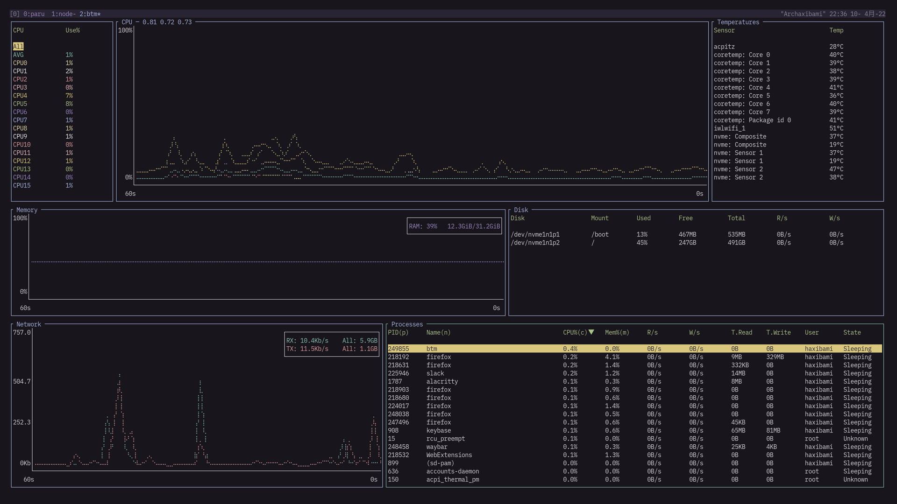
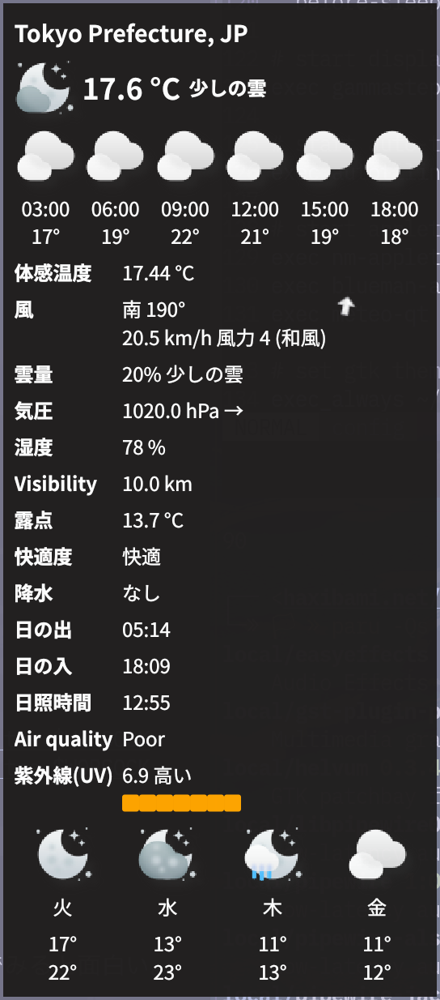

取り上げる内容は概ね以下のリストにあたる（GitHubにリポジトリがあるもののみ）。随時更新する。

https://github.com/stars/haxibami/lists/linux-tools

## システム

### booster

Go製の高速なinitramfsジェネレータ。YAMLで設定を書く。

```yaml title="/etc/booster.yaml"
modules_force_load: amdgpu
```

### bottom

Rust製のプロセス監視ツール。BashtopやGoTopよりシンプルだが、必要十分。



### howdy / fprintd

https://gitlab.freedesktop.org/libfprint/fprintd

LinuxでもWindows Hello（みたいなことができる）。赤外線カメラか指紋リーダーさえ付いていれば、howdy / fprintdをセットアップすることで、ログイン時や`sudo`実行時に生体認証が使える。

#### 注意点

howdy / fprintdによる認証はパスワードを完全に代替するもの**ではない**。したがって、ログイン時にこれらを利用すると、パスワードによって暗号化されたキーリングは[解錠されない](https://github.com/boltgolt/howdy/issues/39)。これを避けたい場合、生体認証は`sudo`用のみ設定することをおすすめする。

さらにリモートログインのことも考慮すると、`sudo`時に一旦通常通りパスワードを訊ねて、入力が空文字列であった場合のみ生体認証へ移行するのが望ましい。このための設定は以下のようになる：

```txt title="/etc/pam.d/sudo"
#%PAM-1.0

auth        sufficient      pam_unix.so try_first_pass likeauth nullok
auth        sufficient      pam_python.so /lib/security/howdy/pam.py
auth        sufficient      pam_fprintd.so
auth        include         system-auth
account     include         system-auth
session     include         system-auth
```

## デスクトップ・ディスプレイ

### lightdm-webkit2-theme-reactive

モダンなLightDM用テーマ。[^1]

[^1]: 壁紙は[Pixiv - Ravioli](https://www.pixiv.net/artworks/89596288)より。[CC BY 4.0 ライセンス](https://creativecommons.org/licenses/by/4.0)


### ddccontrol

外部モニタの輝度・RGB比を操作できるツール。下みたいな力技ができたりする。

```txt title="~/.config/sway/config"
# brightness controls (requires non-root access to i2c devices)
bindsym $mod+F5 exec ddccontrol -f -r 0x10 -W -5 dev:/dev/i2c-1 | grep Brightness | cut -d "/" -f 2 | tee $WOBSOCK
bindsym $mod+F6 exec ddccontrol -f -r 0x10 -W +5 dev:/dev/i2c-1 | grep Brightness | cut -d "/" -f 2 | tee $WOBSOCK
```

### Weylus

ブラウザ経由で手書き描画を受け付ける面白いディスプレイサーバー（？）。筆圧も感知するようなので、タブレットが余っている人はおもちゃにできる。

## ファイル

### onedriver

Go製のOneDriveクライアント。

### google-drive-ocamlfuse

OCaml製のGoogle Driveクライアント。これがなければLinuxラップトップで大学生活を営むのは難しかったかもしれない。

小さなファイルの同期にややボトルネックがあるが、それほど困らない。


## メディア

### yt-dlp

みんな大好き`youtube-dl`の改良版。ブラウザのCookieを利用した認証等が追加されている。

```sh
yt-dlp https://example.com/user/movie/view --cookies-from-browser chrome
```

### playerctl

音声・映像の再生をコマンドラインから制御するツール。ターミナルから操作するだけでも便利だが、キーバインドを設定すると真価を発揮する。たとえばSwayの場合：

```txt title="~/.config/sway/config"
bindsym $mod+comma exec playerctl previous
bindsym $mod+period exec playerctl play-pause
bindsym $mod+slash exec playerctl next
bindsym $mod+shift+comma exec playerctl --player playerctld position -10
bindsym $mod+shift+slash exec playerctl --player playerctld position +10
```

この使用感に慣れてしまうと、もう二度とウィンドウを切り替えてマウスで再生ボタンを押す気にはならない。

### PipeWire

https://pipewire.org/

> PipeWire is a project that aims to greatly improve handling of audio and video under Linux.

PipeWireは`pipewire-pulse`、`pipewire-alsa`、`pipewire-jack`によってPulseAudio、ALSA、Jackをそれぞれ代替するほか、Wayland環境では画面共有・画面録画（WebRTC、OBS）にも使用される[^2]。

[^2]: Tips: 現状、GNOME以外のWayland環境ではちょっと工夫しないとZoomアプリでの画面共有が行えないが、このPipeWireとブラウザ版Zoom を利用することで制限を回避できる。ブラウザ版Zoomの利用には[この拡張機能](https://addons.mozilla.org/ja/firefox/addon/zoom-redirector/)が有用。

### WirePlumber

https://gitlab.freedesktop.org/pipewire/wireplumber

Luaで設定を書けるPipeWireのセッションマネージャ。たとえばデバイスの表示名を変えるには：

```lua title="~/.config/wireplumber/main.lua.d/51-headset-in-rename.lua"
rule = {
  matches = {
    {
      { 'node.name', 'matches', 'alsa_input.pci-0000_00_1f.3.analog-stereo' },
    },
  },
  apply_properties = {
    ['node.nick'] = 'Headset_input',
  },
}

table.insert(alsa_monitor.rules, rule)
```

### EasyEffects

PipeWire 向けのサウンドエフェクトツール。イコライザーとかいろいろ。


systemdを使う場合、以下のように自動で起動できる。

```txt title="~/.config/systemd/user/easyeffects.service"
[Unit]
Description=easyeffects daemon
PartOf=graphical-session.target
After=graphical-session.target

[Service]
Environment="G_MESSAGES_DEBUG=easyeffects"
ExecStart=/usr/bin/easyeffects --gapplication-service
Restart=on-failure

[Install]
WantedBy=graphical-session.target
```

### AutoEq

様々なヘッドホン・イヤホンの特性を測定し、機器ごとにもっともニュートラルな出力ができるイコライザー設定を生成するプロジェクト。もっぱらリポジトリ内の`results`以下に蓄積された計測結果を利用するのが便利だ。前述のEasyEffectsに`.txt`ファイルを読み込ませることで使える。

### noise-suppression-for-voice

マイク用のノイズ抑制プラグイン。タイプ音・呼吸音などを除去してくれる。

```txt title="/etc/pipewire/filter-chain/source-rnnoise.conf"
context.modules = [
    { name = libpipewire-module-filter-chain
        args = {
            node.description = "Noise Canceling source"
            media.name       = "Noise Canceling source"
            filter.graph = {
                nodes = [
                    {
                        type   = ladspa
                        name   = rnnoise
                        plugin = /usr/lib/ladspa/librnnoise_ladspa.so
                        label  = noise_suppressor_stereo
                        control = {
                            "VAD Threshold (%)" 50.0
                        }
                    }
                ]
            }
            audio.position = [ FL FR ]
            capture.props = {
                node.name = "effect_input.rnnoise"
                node.passive = true
            }
            playback.props = {
                node.name = "effect_output.rnnoise"
                media.class = Audio/Source
            }
        }
    }
]
```

### wpctl

WirePlumberの操作ツール。現在の音量等の情報を取り出せる。

```sh
> wpctl get-volume @DEFAULT_SINK@

Volume: 0.50
```

## 入力関連

### fcitx5-mozc-ut

mozcの辞書強化版。地名・人名・キャラクター・ネットスラングに比較的強く、Windows版Google日本語入力の水準に近い。

### rofimoji

rofi / wofi等のランチャーを利用する絵文字パレット。

### apple-emoji-linux

Appleスタイルの絵文字をLinuxで使えるようにするパッケージ。

### libinput-gestures

`libinput`を拡張し、タッチパッドの三・四本指スワイプに任意のコマンドを割り当てられるようにするツール。ブラウザバックとか、ワークスペースの切り替えとか。主にノートPCで便利。

```txt title="~/.config/libinput-gestures.conf"
gesture: swipe right 3 ~/.config/libinput-gestures/gestures backward
gesture: swipe left 3 ~/.config/libinput-gestures/gestures forward
gesture: swipe right 4 swaymsg workspace prev
gesture: swipe left 4 swaymsg workspace next
```

```sh title="~/.config/libinput-gestures/gestures"
#!/bin/sh

case "$@" in
    forward )
        echo "Forward" >> /tmp/gestures.log
        swaymsg seat seat0 cursor press BTN_EXTRA
        swaymsg seat seat0 cursor release BTN_EXTRA
        ;;
    backward )
        echo "Backward" >> /tmp/gestures.log
        swaymsg seat seat0 cursor press BTN_SIDE
        swaymsg seat seat0 cursor release BTN_SIDE
        ;;
esac
```

## その他

### meteo-qt

システムトレイに常駐し、天気予報を通知するアプリ。


