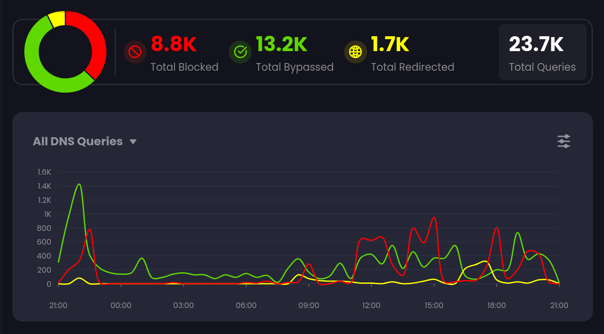
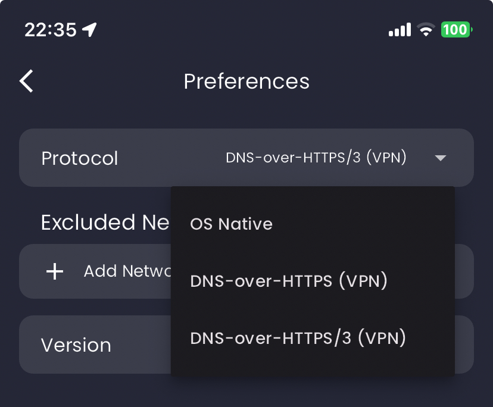
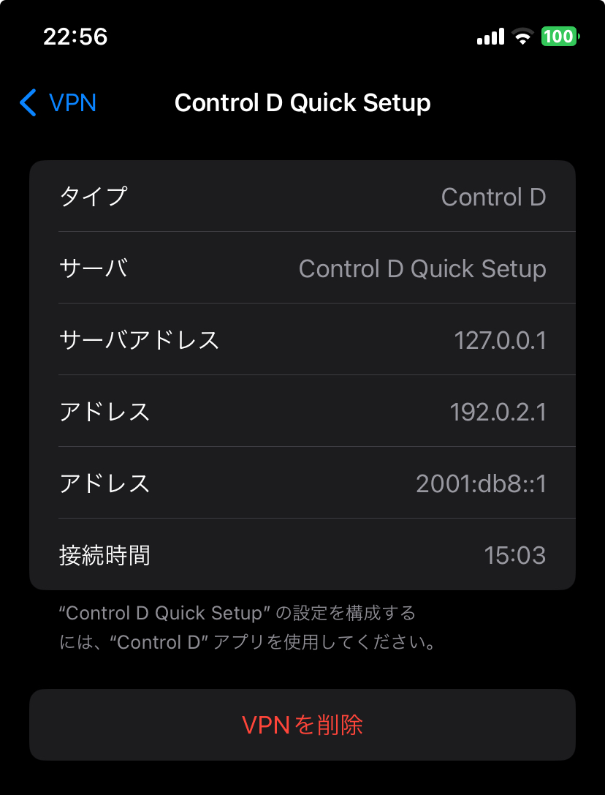
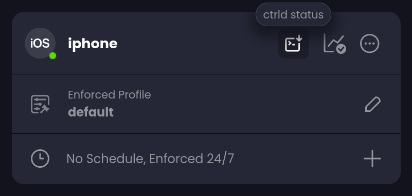
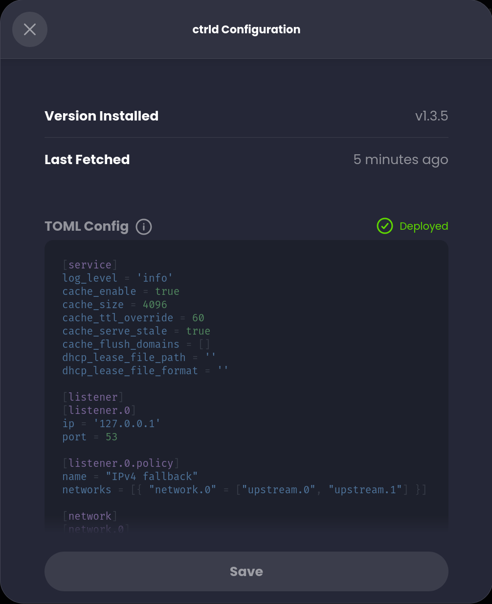
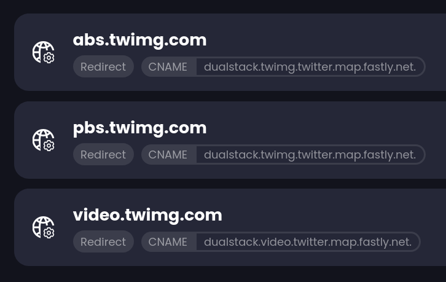
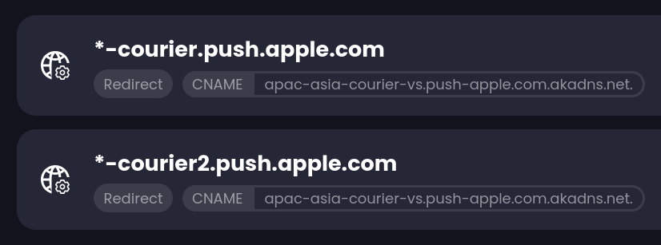

[おととしの記事](/blog/posts/nextdns-install)以来、DNSとして長らく[NextDNS](https://nextdns.io)を使ってきた。ドメイン単位でマルウェアや広告を拒むという簡潔なアプローチで、満足のいく効果を得ていたが、先日[Control D](https://controld.com)という類似のDNSサービスに移行した。日本語の記事も少ないようなので、移行の理由と使用例を書いておく。

## 移行の理由

### more than DNS

NextDNSはDNSサーバの基本に忠実だった。ドメインを受け取り、IPアドレスを返す。受け取り、返す。たまにブロックする。以下同様。

一方で邪悪な[^1]広告とマルウェアの手法は年々巧妙になっている。特に、コンテンツと同じドメインから・コンテンツと密結合して流れてくるような場合には、通常のDNSでは太刀打ちできない。唯一の解決策は、VPN等に手を出して、広告の出ない地域[^2]、あるいは多少\{まとも|ディーセント\}な広告が出る地域からのアクセスを装うことだった。

[^1]: ここでの「邪悪」さには出現形態に加えて内容も含まれる。

[^2]: たとえばYouTubeはアルバニアなどでは広告を出さないし、X / Twitterはウクライナやロシア等では広告を出さない（執筆時点）。

Control DもあくまでDNSサーバであり、その限りではNextDNSと同じ機能をもつ。ただ、あわせて提供される[トラフィック転送機能](https://docs.controld.com/docs/feature-traffic-redirection)、なかでも[位置偽装機能](https://blog.controld.com/why-i-think-you-should-and-shouldnt-use-controld/#selectively-spoof-your-location)がこうした場面で役立つ。やっていることはVPNやプロキシと似ていて、世界各地の[お好みのサーバ](https://controld.com/network)を選んで通信を転送することで、当該地域からのアクセスを装うことができる。ただしVPNとは違い、指定したドメインごとに通信が処理される（ドメインごとに行き先を分けられる・他の通信は影響を受けない）、[当局の検閲には対抗できない](https://blog.controld.com/why-i-think-you-should-and-shouldnt-use-controld/#life-critical-anonymity)、などの特色がある。

要するに「アクセス元の地域を様々に変えたいが、VPNほど仰々しい匿名性は要らない」というのがこの機能の想定するユースケースである。これには先に述べた広告やマルウェアへの対処のほか、提供地域が限られた海外コンテンツ等を利用する場合も含まれる。

### ルールのきめ細かな管理

特定のサービスの関連ドメインについて、そのDNS応答を一括で処理したい、という場合はしばしばある（例：「X / Twitterはすべて拒否」）。NextDNSでは、数十種類のサービスについて「拒否（とその時間制限）」のみを選択できた。他方、Control Dでは数百種類[^3]について「許可・拒否・転送」を設定できる。また、自分で作成したカスタムルールも[フォルダ](https://docs.controld.com/docs/folder-rules)で管理できる。

[^3]: ["over 400 different services"](https://blog.controld.com/control-d-vs-nextdns/#what-does-control-d-have-that-nextdns-does-not)

### iOSでDNS-over-HTTP/3が使いやすい

iOSでNextDNSを利用する際、公式にサポートされている方法は、直接プロファイルをダウンロードするか、公式アプリを利用するかのいずれかであった。これらはいずれもiOSの[プロファイル](https://developer.apple.com/documentation/devicemanagement/dnssettings)機能を利用して暗号化DNSを設定する。この場合、DNS-over-HTTPSは利用できるが、HTTP/3が利用されるかは運任せとなる（ほぼ利用されない）。

他方、Control Dの場合、プロファイルによる設定に加えて「VPNとして動作させる」方法が用意されており、確実にHTTP/3を利用できる。





この方法は名前こそ「VPN」だが、実際にはローカルで[ctrld](https://github.com/Control-D-Inc/ctrld)（公式のコマンドラインクライアント）を動作させ、そこに接続している（つまりWindows / Mac / Linux等での利用方法と同じ）。そのためこれらの場合と同様、[TOML形式で設定](https://github.com/Control-D-Inc/ctrld/blob/main/docs/config.md)を行える。設定ファイルはコントロールパネル（`Endpoints` > エンドポイント > `ctrld status`）から投入する。





### 開発が活発

NextDNSはそれなりに成熟している、というか保守的で、新機能の追加はあまりない。開発の活発さという点ではControl Dが勝る。

### たまたま安かった

[StackSocial](https://www.stacksocial.com/)にて、サブスク5年分の公式の[バウチャー](https://www.stacksocial.com/sales/control-d-5-year-subscriptions)（約40ドル→クーポンで約32ドル）が売られていた[^4]。これを買うと、[二種類あるプラン](https://controld.com/plans)のうち下位（転送機能なし、定価年間20ドル）が有効になるが、じつは年間10ドルを追加で払うことで、上位のプラン（定価年間40ドル）に変更できる。総計すると5年で約82ドル（年間約16.4ドル、定価の4割ほど）となり、NextDNS（年間20ドル）よりも安い。

[^4]: 執筆時点では販売終了している。以前も[別のバウチャー](https://www.stacksocial.com/sales/control-d-2-yr-subscription-standard-features)があったようなので、同じように復活するかもしれない。

## 使用例

### 位置偽装

多国籍企業が都合よく国境を跨ぐとき、ユーザもまた都合よく国境を跨ぐ。国ごとにコンテンツや広告の出し分けをするサービスに対しては、ユーザ側も適度にVPNやプロキシを使うのが礼儀である。

このとき、広告のない国に繋いでメリットを享受するのもひとつの選択だが、より建設的なのは、通常と同じように広告を見てサービスに貢献しつつ、邪悪な広告が出る地域は避ける、という選択である。

実のところ、どうせクリックしないならどの地域の広告を見ても変わりはない（いずれにしてもサービス側に対価は支払われる）。広告を見ることに同意したからといって、その提供元も選べないというわけではないのだ。

### IPv6化

ところで、Control Dのトラフィック転送機能には、上で述べた位置偽装だけではなく、純粋に[ドメインの宛先を変える](https://docs.controld.com/docs/custom-rules#create-private-domains)（A / AAAA / CNAMEレコードを任意に書き換える）機能も含まれる。この機能を活用して、さまざまなサービスにIPv6を利用させる設定をしているので、紹介する。

#### Twitter / XのCDN

Twitter / Xのアセット配信（`abs.twimg.com`, `pbs.twimg.com`）には、複数社（Akamai, Edgecast, Fastly）のCDNがランダムに使われる。しかし各社の応答速度にはばらつきがあり、場合によってはIPv4しか対応していないこともある[^5]。そこでCNAMEレコードを固定して、高速かつIPv4 / IPv6両対応のCDNを使うようにする。

[^5]: たとえば`abs.twimg.com`でFastlyが選択されると、IPv4でしか接続できない（執筆時点）。

体感では、三社のうち最も速いのはFastlyだった。FastlyのCDNは、ドメインの冒頭に`dualstack.`を付けるとIPv4 / IPv6双方で応答してくれる。そこで`abs.twimg.com`, `pbs.twimg.com`が`dualstack.twimg.twitter.map.fastly.net.`に向かうようCNAMEレコードを設定する。



耐障害性はやや下がるが、画像読み込みの体験が少し改善する。

#### iOSの通知

[ある投稿](https://x.com/shibanyan_1/status/1773210671175389577)を見て知った。曰く、iOSの通知は現時点ではIPv4のみで流れてくるが、背後にはIPv6対応のインフラが存在するため、CNAMEレコードをいじればIPv6で受け取れるらしい。



画像のように`*-courier.push.apple.com`を`apac-asia-courier-vs.push-apple.com.akadns.net.`に向ければ、当該ツイートと同じことが実現できる（Control Dでは[ルールにワイルドカードを使える](https://docs.controld.com/docs/custom-rules#rule-format)）。

#### Discord

ほとんどバグのような現象だが、実はCloudflareのCDNを使っているサイトは、たとえ**IPv6を有効化していなくてもIPv6でアクセスできる**ことが知られている（参考：[Redditの投稿](https://www.reddit.com/r/ipv6/comments/e8gr7b/discord_works_on_ipv6_if_you_force_it/)）。

というのも、サイトに割り当てられる（はずだった）CDNのIPv6アドレスは、IPv4アドレスから機械的に算出できるからである。算出したアドレスを、ドメインのAAAAレコードとして応答するように設定すると、IPv6でアクセスが通るようになる[^6]。

[^6]: もちろん、これによってIPv6が使われるようになるのはクライアント-CDN間の通信のみである。CDN-オリジン間の通信は（ユーザには知りようがないが）おそらくIPv4で行われている。

```typescript title="IPv6アドレスを算出するスクリプト（TypeScript, Bun）"
// index.ts
// Run this with [Bun](https://bun.sh): `bun run index.ts <ipv4>`

const CF_IP_PREFIX = "2606:4700::";
const ipv4 = Bun.argv[2]?.split(".").map(Number);

if (
  !ipv4 ||
  ipv4.length !== 4 ||
  ipv4.some((n) => Number.isNaN(n) || n < 0 || n > 255)
) {
  console.log("Usage: bun run index.ts <ipv4>");
  process.exit(1);
}

let ipv6 = CF_IP_PREFIX;

for (let i = 0; i < 4; i++) {
  if (i === 2) {
    ipv6 += ":";
  }

  ipv6 += ipv4[i].toString(16).padStart(2, "0");
}

console.log(ipv6);
```

IPv4にしか対応していないDiscordも、CloudflareのCDNを使っているため、この方法で（ほぼ）IPv6化できる。詳細は省くが、いくつかのドメインについて適切なA / AAAAレコードを設定すれば動作するはずだ。

なお、ログイン時に`gateway.discord.gg`宛てに飛ぶ通信、およびCloudflareを使っていない一部のサブドメインについてはIPv6を利用できない。これらは除外する必要がある。

## おわりに

おそらくYouTubeとX / Twitterの広告が消せる唯一のDNSサービスである。5年分契約してしまったので、しばらくはこれでやっていく。
