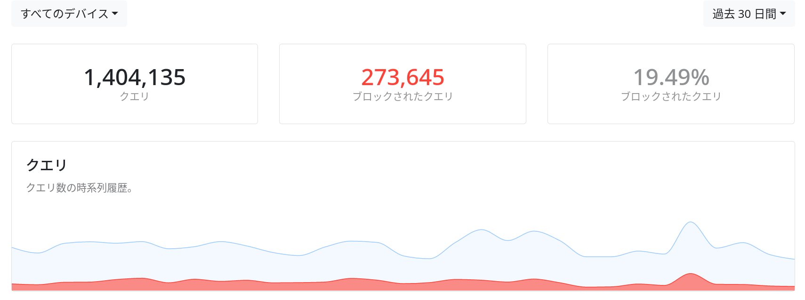

なんにせよ身売り先は選ばなければならない。Google、Apple、Meta、Amazonと情報を切り売りし、広告をあしらいながら暮らすことはすでにわれわれの（彼らの？）既成事実になったが、まだどこにどの程度売りつけるかを選ぶ余地はある。願わくばどんな広告を許容し、どんなものを拒否するかということも。

いまやかなりの情報はユーザーの管理外で出入りしている。トラッカーとテレメトリは裏で知らないドメインと通信し、トラフィックの一定割合は有象無象の広告で占められる。情報の利用許可を取るサイト、これはまだ良心的なほうだ。商業サイトではその何倍もの情報が毎日どこかに送りつけられ、あるいはどこかから送りつけられ、その宛先・差出人をわれわれは目にしない。情報を渡すこと自体をいまさら争うつもりはないが、その出入りが（解析でもしない限り）ブラックボックスなのは嬉しくない。

[NextDNS](https://nextdns.io)はそのようなインターネットトラフィックの管理、規制、可視化を可能にする DNS サービスだ。有料版（2500 円 / 年）を使い始めて3ヶ月ほど経った所感を書いておく。

## 機能

### マルウェアと広告の除去

最大の強みといっていい。巷には受信済みの広告をブラウザ内で非表示にするだけのブロッカーもあるが、NextDNSはDNSサーバ自体の振る舞いを変更して詐欺・広告配信・トラッキングに関わるドメインをブロックする。これにより、

- 通信量の節約
- パフォーマンス向上
- より広範な情報収集（アプリ内広告、テレメトリ送信）の拒絶

が見込まれる。

DNSでのフィルタリング自体は汎用的な手法で、たとえば[Pi-hole](https://pi-hole.net)なんかのフリーウェアもある。これは無料かつ非中央集権的なのが魅力だが、自宅でサーバを常時動かす必要があるうえ、VPNを使わない限り外出時には効果がない。その点こちらは企業により提供されるサービスではあるが、あらゆる場所からのアクセスと複雑なフィルタリング、高速なパフォーマンスといった強みがある。

### 高速・セキュア

提供されるクライアントを使うと、全てのDNSトラフィックがDNS over HTTPSで暗号化される。

さらにCLIクライアントではローカルに問い合わせ結果がキャッシュされる。環境依存としかいえないが、私の手元では家庭用ルータのデフォルト（プロバイダのDNS）に任せるより明らかにレスポンスが高速だった。

### トラフィックの監視

DNSトラフィックのログはリアルタイムで閲覧できる。上は`microsoft.com`にアクセスした直後のものだが、かなりの数のリクエストがブロックされているのがわかる。こういうのが可視化されるのは良い。

ログは保管地域をアメリカ、スイス等から選べて、一定期間であればダウンロードできる。最終的に企業を信用するかという問題は残るが、**_BIG TECH_**のいう「プライバシー重視」が、どこで何を遮断しているのか明らかであったことがないのに比べれば、だいぶマシだ。

### マルチプラットフォーム

iOS / Android / Windows / MacOS / Linuxの主要OSに対応している。Arch LinuxではAURからインストールできる。

## NextDNSの思想

### オープンソース志向

CLIクライアント（とWindows向けGUIクライアント）はオープンソース（Go）で開発されている。理由はともあれ、オープンソースは善いものであるというのがリベラルギークのみなさんの総意だろう（じっさいにそれがどのような種類の善であるかは検討が必要だが）。

### 広告産業と寡占への対抗

ダッシュボードからはDNSトラフィックの分類表が確認できる。最初に貼った月間クエリ数・ブロック数の統計とあわせると、トラフィックの半分近くが\{例の 5 社|GAFAM\}によって占められ、じつに 20%近くが広告配信・トラッキングドメインであることがわかる。こういう統計を提供していることからわかる通り、NextDNSの基本姿勢は自分の通信の管理・分析手段、広告への対抗手段の提供だ。

## 問題点

### 誤爆

この手のツールの宿命として、健全な広告や決済サイトまで過剰にブロックすることがある。効果がよく現れているともいえるし、ホワイトリストを使って特定のドメインとの通信を全面許可すれば対応できるが、いちいちどのドメインが原因か調べてリストに追加するのは（Webから設定できるとはいえ）やや手間だ。

### 集合行為問題

#### 批判

よく持ち出される批判として、全員が広告をブロックし始めると業界が崩壊するというやつがある。インターネットコンテンツを広告閲覧という平等な負担の分け合いによって成立しているものとすれば、提供物を享受しながらその負担を拒むことはある意味フリーライド行為にあたるからだ。「広告閲覧という平等な負担」という文字列の滑稽さに目をつぶればこの主張はあたっているし、実際に影響として現れている。先日、技術ドキュメント翻訳サイトの運営者が利用者層ゆえの広告拒否率の高さを[嘆き](https://twitter.com/HiroKws/status/1491270754608226306)、運営中止を示唆していたのがそれだ。確かに広告ブロックにはその意味でタックス・ヘイブン的な邪悪さがある。

これに対し、リベラル・ギークならこう反応するかもしれない：勝手に広告表示して何が対価だァ、そもそも広告ベースの収益モデルをやめろ、云々。正直私もこっちに与している。しかし問題なのは誰も実際に広告資本主義のオルタナティヴを思いついていないということだ。寄付？　[Marak Squires](https://gigazine.net/news/20220111-open-source-developer-corrupts-libraries/)の前で同じことが言えるならそれもアリだろう。

ちょうど言及してしまったが、このあたりの話はオープンソースソフトウェア（以下OSS）の寄付問題とも重なる。OSSはいまや大企業の収益を支える不可欠な要素であるにもかかわらず、その作者はしばしば報われない。ここにも多数のフリーライダー（私もその一員だ）が見え隠れしている。ましてやオープンソースの場合、広告も付けようがないからより困難だ。だってフォークすれば消せるじゃん。

さらに悪いことに、逆説的ながら広告ブロックは健全な広告をより減退させる可能性もある。なぜなら、フリーライダーが巨視的な効果を及ぼすほどに増え、すべての広告が均一に圧迫されたとき、最初に痛みを蒙るのは悪質で大規模な広告ではなく、控えめで従順、良質な広告のほうだからだ。ここで疑問が頭をもたげる。きみの広告ブロッカーが追い詰めているのは**_BIG TECH_**ではなく、きみの愛する表現者であるとしたら？

要するに、広告ブロックを広範に提供することの問題はフリーライダーを抑制できないことと、望ましいコンテンツの収益を奪ってしまうことだ。結論からいえば、私はブロッカーの提供者が 1. 金を取って 2. カスタマイズを提供していればそれほど問題ないのではないかと考えている。

#### 1. 有料性、悲劇の抑止

NextDNSは月間300000クエリまでは無料だが、それ以上はフィルター・プライバシー保護のないただのDNSになる。一方有料版は年間2500円 / 月間250円でクエリ数が無制限だ。端末の使い具合にもよるが、私はiPhone一台だけでも30万クエリに達しているので、インターネット好きな人間が複数端末で常用するなら（おそらく）有料版を使うことになる。

しばしば言われる通り、有料でサービスを提供することはそれ自体かなり利用者を絞れる。フリーライダーがフリーライダーたるゆえんは負担を払わないことだ。無料で集まるユーザと、わざわざ課金する層では明らかに目的が異なる。少額でも負担を課せばユーザーはその価値を真剣に検討せざるを得ない。それに負担を払う人間にはそれなりの関心も期待できる。たとえば広告ブロックの場合、気に入ったサイトについてはあえてトラッキングを許容するのも辞さないというような種類の関心だ。

#### 2. カスタマイズ性

そこでカスタマイズ性が活きてくる。先に述べたホワイトリストは単に過剰ブロックを緩和するだけの機能ではない。これを使って特定のドメインに対して広告、調査を許可してやれば、まさしく選択的に投げ銭をしていることになる。すべて垂れ流しにするより、あるいはすべてを拒むより、このほうがよほど有益ではないだろうか？

## 総評

それなりに満足している。試用するぶんには無料なので、ぜひみなさんも有効にしてアフィカスサイトに突撃してみてほしい。

https://nextdns.io/?from=qwqkwe56

:point_up_2: ところで……[^1]

[^1]: これは一種のアフィリエイトリンクである。みなさんがここを踏んでNextDNSを契約すると、私に一定のPayPal残高が送金される。さて、私を軽蔑するだろうか？
