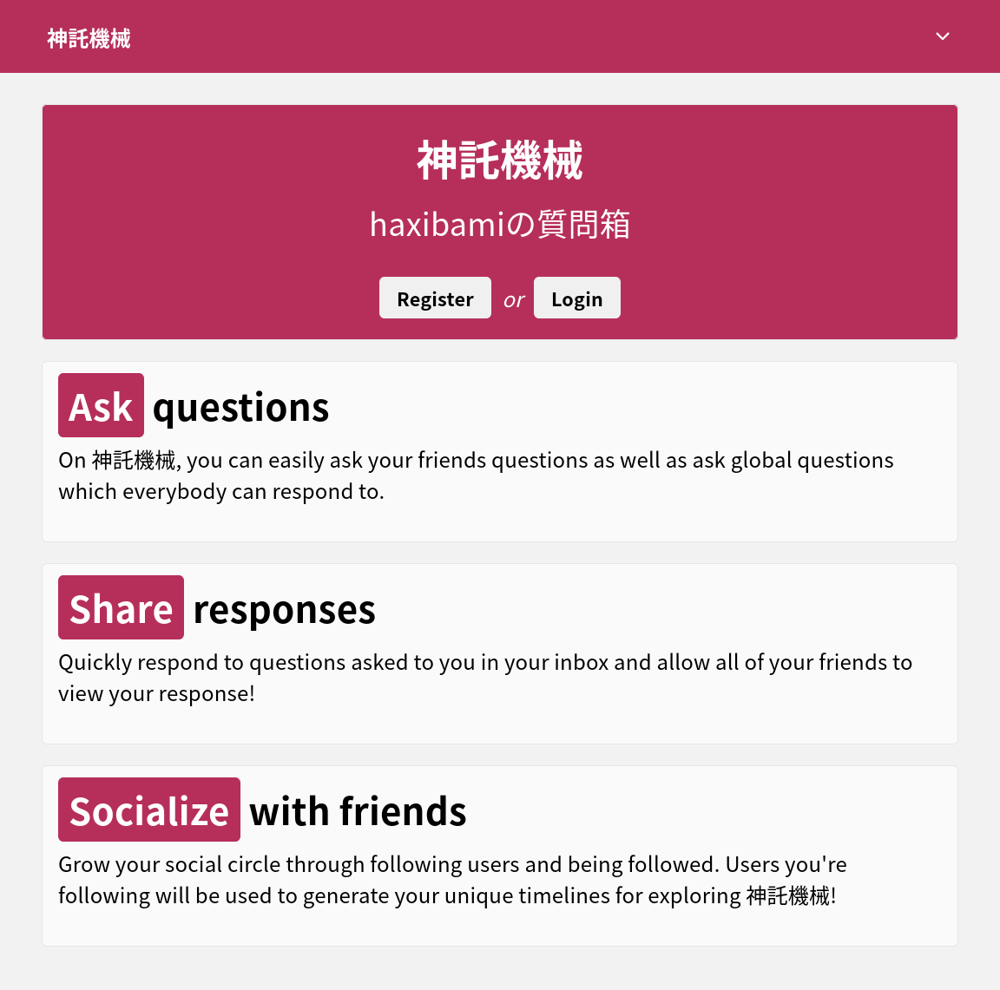

ごきげんよう。各位馴れ合っているか？　こちらも馴れ合っている。主に質問箱で。

ある種の勇敢さをもった人々にとって、質問箱、すなわち匿名コミュニケーションとは弱気の同義語にすぎない。また別の慎慮ある人々にとっては、それらは唾棄すべき馴れ合いの道具だ。彼らの言い分を総合すると以下のようになる：\{顕名でしゃべるか|オール}、\{あるいは|オア}、\{何もしないか|ナッシング}。両者のあいだに道はない。ちょうど天と地のあいだに安住の地がないのと同じように。

しかし（ここで目を瞑る）、\{私|きみたち}がコミュニケーションをどうみなすかという問題と別に、\{私|きみたち}とコミュニケーションをとる相手がどういう視点をとるかという問題もまたある（驚くべきことに）。事実、\{私|きみたち}のような愛想の悪い人間を相手するにあたっては、コミュニケーションの中間的なモードが役立つこともあるらしい。そのことに気づいたのは後になってからだが、ともかくも、何を隠そう、私はしばらく前から質問箱を開いていた。そして**良い帰結**を得た。賭けに勝ったのだ。

さて、なぜ今になってこんな話を始めたかといえば、使っていた質問箱――[Retrospring](https://github.com/Retrospring/retrospring)――の開発が終わり、公式サーバ（`retrospring.net`）も近く閉鎖されることが決まったからだ（[出典](https://blog.retrospring.net/retrospring-is-shutting-down-on-1st-march-2025)）。質問箱サービスは数多あるが、Retrospringはソースコードが公開されているという点で（以前は）唯一無二だった。シンプルながら最低限の機能をもち、怪しげな広告や外部サービスとの連携もなく、便利とはいえないまでも、ある程度\{まとも|ディースント}ではあった。だがそれももう終わりだ。終了の理由として示された文言には、どこか哀愁を誘うような調子がある。

> Retrospring never was a large company, as many might have assumed. It never was a company at all. Retrospring started as a project by two friends, later having another one join, and someone leaving again. So, currently, the entire site is being taken care of by 2 people.
>
> With service quality steadily degrading and us not being able to keep up anymore, which is turning into more and more of a liability with our current user counts, we are deciding to shut down the service.

かくしてまたひとつ墓碑が増え、われわれは路頭に迷う。そして[リ](https://marshmallow-qa.com)[ヴァ](https://peing.net/ja/)[イ](https://querie.me/)[ア](https://boxfresh.site)[サン](https://zabuu.site)の餌食に……

ならずに済みそうだ。幸いにも、ほぼ後継といっていい[^1]ソフトウェアの開発が始まっていた。

[https://github.com/swmff/rainbeam](https://github.com/swmff/rainbeam)

Rainbeamといい、Rust製、シンプル志向、といかにもおたく好みの味付けだ。使い勝手は[公式インスタンス](https://neospring.org)に登録して確認できる。

[^1]: Rainbeam is a faithful recreation of the amazing Q\&A site Retrospring. Rainbeam uses many Retrospring's core concepts, ideas, and designs, however it is built from the ground up and uses none of Retrospring's original code or assets. （READMEより）

駆け出しのプロジェクトらしく、まだ導入手順等のドキュメントは整っていない。しかし操作感・UIが好みなので、セルフホストできるか試してみた。

## 要件

### 動作に必要なもの

- RAMが1GB程度のLinuxサーバ
- Redis
- SQLite3
- リバースプロキシ（CaddyやNginx）
- [hCaptcha](https://www.hcaptcha.com)のサイトキー・シークレット

1GBと書いたが、実際のメモリ消費はもっと少ないうえ、常に負荷がかかるような代物でもないので、よりささやかな環境でも動くかもしれない。今回は[OCI Cloud Free Tier](https://www.oracle.com/jp/cloud/free/)で建てたインスタンス（`VM.Standard.E2.1.Micro`, Ubuntu 24.04 minimal）を使う。

### ビルドに必要なもの

- Linux環境（おそらく[^2]）
- `build-essentials`ないしそれに類するツール群（`gcc`など）
- Rustのビルド環境
- [`just`](https://just.systems)（タスクランナー）
- `pkg-config`
- `libssl-dev`

[^2]: というのも、他のOSでのクロスコンパイルが通るかは不明なので（試していないが、OpenSSLにリンクしている関係でたぶんうまくいかない）。

ビルドはそれなりに重い。動作させるサーバ上で直接ビルドしてもよいが、サーバのスペックによってはありえない時間がかかり[^3]、待ち時間に九十億の神の御名を数え終わってしまうので、別のマシンで行うのが無難だろう。日常的にLinuxを使っていないかわいそうなユーザの場合、DockerやGitHub Actionsなどで適当なビルド環境をでっち上げる必要がある。

[^3]: そのうえメモリ消費も激しい（参考までに：RAM 1GB + スワップ領域4GBの環境で、スワップ1\~2GBを消費）

## ビルド

### 依存関係のインストール

```sh
# Ubuntu 24.04 の場合
sudo apt install build-essentials rustup just pkg-config libssl-dev
```

### 実行

リポジトリをクローンし、`just build`でビルドを実行する。引数には利用したいデータベースのバックエンドを指定する。小規模・個人用の場合はSQLiteで十分だろう（PostgreSQLやMySQL / MariaDBも選べるらしい）。

```sh
git clone https://github.com/swmff/rainbeam
cd rainbeam
just build sqlite
```

終わったら`./target/release/rainbeam`にあるバイナリをサーバ上に転送しておく。

## サーバの設定

以下、サーバのIPと紐づいたドメイン（`ask.example.com`とする）の設定は済んでいるものとする。CloudflareなりなんなりのCDNを挟む場合もあらかじめ設定を済ませておく。

### 依存関係のインストール・有効化

```sh
# Ubuntu 24.04 の場合
sudo apt install redis sqlite3 caddy
sudo systemctl enable redis-server --now
sudo systemctl enable caddy --now
```

### 設定ファイルの編集

サーバ上にもRainbeamのリポジトリをクローンしておく。この作業は厳密には必要ないが、リポジトリの`./.config/`以下に備わっている設定例・デフォルトの画像等を利用するために行っている。

以下、すべての作業はクローンしたリポジトリのルートディレクトリで行う。

```sh
git clone https://github.com/swmff/rainbeam
cd rainbeam
```

まず`./.config/config.toml`に設定を書く。`./.config/config.example.toml`にサンプルがあるほか、[設定を読み込むコード](https://github.com/swmff/rainbeam/blob/master/crates/rainbeam-core/src/config.rs)に各項目の説明が書かれているので参照するとよい。取得しておいたhCaptchaのキーとシークレットはここに書き込む。

```toml title="./.config/config.toml"
port = 8080 # Rainbeamが待ち受けるポート
name = "きみの質問箱"
description = "🌈"
static_dir = "" # 静的ファイルを置くディレクトリ。デフォルトでは作業ディレクトリ直下の ./.config/static/
registration_enabled = true # ユーザ登録を許可するか否か（後述）
host = "https://ask.example.com" # きみの設定したドメイン
blocked_hosts = []
migration = false
real_ip_header = "CF-Connecting-IP" # CloudflareのCDNを挟む場合

[captcha]
site_key = "hCaptchaのサイトキー"
secret = "hCaptchaのシークレット"

[tiers]
double_limits = 1
stylish_card = 1
avatar_crown = 1
profile_badge = 1
pages = 1
```

続いて`./.config/static/site/about.md`を編集する。どこにも明記されていないが、これが`/site/about`に表示される説明文になる（[例](https://ask.cune.moe/site/about)）。

```md
## この質問箱について

- お前も**本当に美しい**魂になりたいんだろ？
  - なりたければ[プロフ](https://www.haxibami.net/about)みて
```

### ちょっとしたハック

```sh
touch main.db
```

執筆時点では、作業ディレクトリにSQLiteのファイル（`main.db`）があらかじめ存在しないと起動時にパニックを起こす。空ファイルでよいので作成しておく。

### リバースプロキシの設定

良き慣習に従い、インターネットとの界面にはリバースプロキシを挟むことにする。Nginxの設定ファイルは**絶対に書きたくない**ので、**人間の顔をした唯一の**WebサーバであるCaddyの例のみを示す。

```Caddyfile title="/etc/caddy/Caddyfile"
ask.example.com {
	# Caddyの自動SSLを使わず別の証明書（Cloudflareの証明書など）を使う場合はそれも指定
	# tls /etc/ssl/certs/cloudflare.pem /etc/ssl/private/cloudflare.key
	encode zstd gzip
	reverse_proxy localhost:8080
}
```

```sh
sudo systemctl restart caddy
```

### systemdのセットアップ

任意だが、systemdでサービスを管理したいならユニットを書いておく必要がある。ユーザ名・ディレクトリは適宜読み替えること。

```systemd title="/etc/systemd/system/rainbeam.service"
[Unit]
Description=Rainbeam daemon
Requires=caddy.service
After=caddy.service network-online.target

[Service]
Type=simple
User=rainbeam
ExecStart=/usr/local/bin/rainbeam
WorkingDirectory=/home/rainbeam/rainbeam
TimeoutSec=60
StandardOutput=journal
StandardError=journal
SyslogIdentifier=rainbeam
Restart=always

[Install]
WantedBy=multi-user.target
```

変更を反映してユニットを有効化する。状態を確認し、問題なさそうなら、ブラウザから設定済みのドメインにアクセスしてみる。

```sh
sudo systemctl daemon-reload
sudo systemctl enable --now rainbeam
```

```console
> systemctl status rainbeam
● rainbeam.service - Rainbeam daemon
     Loaded: loaded (/etc/systemd/system/rainbeam.service; enabled; preset: enabled)
     Active: active (running) since Sat 2024-10-26 03:28:55 UTC; 13h ago
   Main PID: XXXX (rainbeam)
      Tasks: X (limit: XXXX)
     Memory: 16.6M (peak: 17.3M)
        CPU: 3.589s
     CGroup: /system.slice/rainbeam.service
             └─XXXX /home/rainbeam/rainbeam/target/release/rainbeam

2024-10-26T03:28:55.678132Z  INFO 🌈 Starting server at: http://localhost:8080!
```

うまくいけばトップページが表示されるはずだ。



## 初期設定

この時点では「来る者は拒まず」状態で、あらゆるユーザが登録できてしまう。自分の登録が済んだら、いったんサービスを止め、[設定](#設定ファイルの編集)の`registration_enabled`を`false`に変更して再起動する。

あとはプロフィール等を設定すれば完成だ。

## 結果

そういうわけで[質問箱](https://ask.cune.moe)が建った。いつでも匿名コミュニケーションをお待ちしています。
