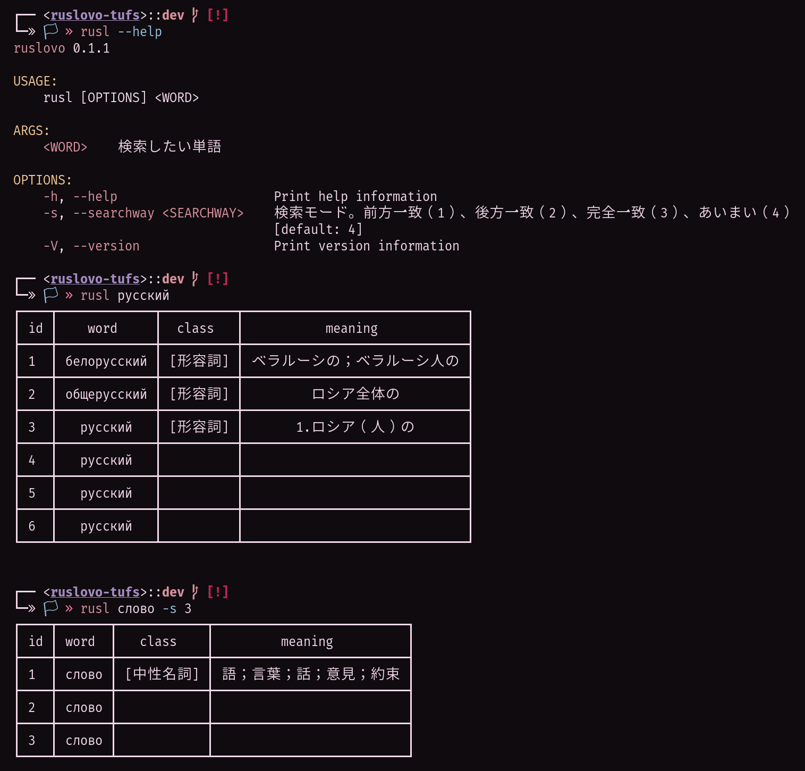

## きっかけ

ロシア語を勉強する学生が必ずといっていいほどお世話になるものがひとつあり、[東京外国語大学のロシア語辞書](http://cblle.tufs.ac.jp/dic/ru/)がそれだ。このインターネット時代、そのへんを探せばオンライン単語帳くらいごまんとありそうなものだが、ロシア語に関してはあんまりない。というかこれしか有用なのがない。ゆえに誰もが（たぶん）使っている。紙の辞書？　研究社露和辞典をどうぞ。[^1]

[^1]: 定価8580円（2022/02/11 調べ）

さてこの辞書、学外で使わせていただいているという立場上本来なら文句をつけるのも筋違いなわけだが、不満がないわけではない。ちょっとアクセスしてもらえばわかるだろう。`Enter`キーで検索ができないとか、ゼロ年代インターネットっぽい要素配置とか、SSL未対応とか（これはもうどうしようもない）、それもそのはず、ページ最下部に煌めく "2005" の文字。マジで？

包み隠さずにいうと、ユーザー体験があまりよろしくない。とはいえ、なにか高度なインターフェースが必要なたぐいのものでもない。私としては、ささっとコマンドラインから単語が検索できて、結果が綺麗に表示されればそれで構わない。ちょうどなにか CLI ツールを作りたいと思っていたこともあり、これを題材にできないか考えてみた。

しかしこの辞書、APIが公開されているわけもなく、適当にJSONかなにかでデータを引っ張ってくることはできない。そこでURLを見てみる。単語 "русский" を検索した結果のURLが以下だ。

```txt
http://cblle.tufs.ac.jp/dic/ru/v_search_list.php?serchTxt=%D1%80%D1%83%D1%81%D1%81%D0%BA%D0%B8%D0%B9&searchWayID=4&serch_button=%E3%80%80%E6%A4%9C%E7%B4%A2%E3%80%80
```

文字をデコードして必須要素を並べると以下のようになる。

```txt
http://cblle.tufs.ac.jp/dic/ru/v_search_list.php?serchTxt=русский&searchWayID=4
```

だいぶわかりやすいクエリパラメータが見えてくる。少なくとも「検索したい単語」`serchTxt`（原文ママ）と「検索方法」`searchWayID`から URL を生成して問い合わせれば、望んだ単語の検索結果は取得できそうだ。

あとは取得したHTMLを適当にパースしてターミナルに出力すればよく、この程度の作業ならどんな言語でも実装できる。そういうわけでRustで書いた。

## 中身

https://github.com/haxibami/ruslovo-tufs

なお、以下のクレートを切り貼りしたようなものなので、とくに付け加えることはない。

## 使ったクレート

- [ureq](https://github.com/algesten/ureq)
  - 軽量のHTTPクライアント。[reqwest](https://github.com/seanmonstar/reqwest)のオルタナティヴ。
- [clap](https://github.com/clap-rs/clap)
  - コマンドライン引数のパーサ。簡単に引数が取得できて、 `--help` やらの出力設定も勝手に行われる。今回のような軽い用途にはやや過剰の感もある。
- [tl](https://github.com/y21/tl)
  - HTML のパーサ。何と比べればいいのかよくわからないが、少なくとも今回の処理で速度上の問題を感じることはなかった。
- [tabled](https://github.com/zhiburt/tabled)
  - struct をいい感じに整形してターミナルに出力してくれる。

## できたもの



## 感想

Rust自体というよりも、パッケージマネージャのCargoがおそろしく便利だった。ライブラリを引っ張ってくるのに手間がかからないので、初心者にも参入しやすい。こういうツールを軽く作るにはかなり良いかもしれない。
