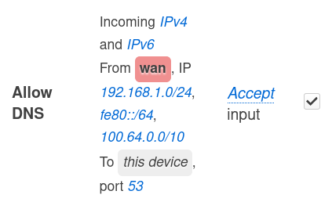

もうわれわれはほろ苦い青春の思い出（おそるおそる自宅ルータのポートを開ける・移り気なIPを追いかけてDDNSでドメインを振る・得体の知れない無料VPNに身を委ねる）に悩まされなくていい。なぜなら[Tailscale](https://tailscale.com/)があるから。

https://tailscale.com/

以下は知っておけばよかったTailscaleの小技集。

## テクニック編

### 他のデバイスと直接疎通できるか確認する

```console
> tailscale ping mydevice
pong from mydevice (100.X.Y.Z) via DERP(tok) in 10ms
pong from mydevice (100.X.Y.Z) via DERP(tok) in 10ms
pong from mydevice (100.X.Y.Z) via [2001:db8::1]:41641 in 8ms
```

直接疎通できるまで何度か試行してくれる。疎通できなかった場合、経由した[リレー](https://tailscale.com/kb/1232/derp-servers)が表示される。

### ファイアウォール等でtailnet内からのアクセスを判別する

`100.64.0.0/10`からのアクセスは、tailnet内からのアクセスとみなせる[^1]（TailscaleはこのIP範囲から各デバイスにIPを[割り振る](https://tailscale.com/kb/1015/100.x-addresses)ため）。以下はLAN内とtailnet内のみアクセスを許可する例[^2]。

[^1]: ところでこのIP範囲は、ISPがキャリアグレードNAT（？）を行う際に用いるIP範囲でもある。したがってインターネット側と接続されているデバイスの場合、ISPによっては、この判別が厳密に機能しない可能性もある。

[^2]: 「WAN」と書いてあるが、この端末（OpenWRT）は別のルータの配下にぶら下がっているため、WAN側が「LAN内」になる。



## トラブル編

### `/etc/resolv.conf`が勝手に書き換えられる

デフォルトの設定では `nameserver 100.100.100.100` に書き換えられてしまう。ローカルで別のDNSプロキシを使っているなどの理由で、書き換えてほしくない場合、

```sh
tailscale up --accept-dns=false
```

とすると回避できる。ただしこのままでは[MagicDNS](https://tailscale.com/kb/1081/magicdns)の解決が行われないので、お使いのDNSプロキシ等で`*.ts.net`の解決を`100.100.100.100`に委ねるとよい（以下は[ctrld](https://github.com/Control-D-Inc/ctrld)の例）。


```toml title="/etc/controld/ctrld.toml" {18}
[upstream.0]
...

[upstream.1]
bootstrap_ip = "100.100.100.100"
endpoint = "100.100.100.100"
name = "Tailscale IPv4"
timeout = 5000
type = "legacy"
ip_stack = "v4"

[listener.0]
ip = "127.0.0.1"
port = 53

[listener.0.policy]
name = "IPv4"
rules = [{ "*.ts.net" = ["upstream.1"] }] # *.ts.netの解決を100.100.100.100に委譲
networks = [{ "network.0" = ["upstream.0"] }]
```

```console
> drill @127.0.0.1 mydevice.tailxxxxx.ts.net
;; ->>HEADER<<- opcode: QUERY, rcode: NOERROR, id: 5354
;; flags: qr aa rd ra ; QUERY: 1, ANSWER: 1, AUTHORITY: 0, ADDITIONAL: 0 
;; QUESTION SECTION:
;; mydevice.tailxxxxx.ts.net.	IN	A

;; ANSWER SECTION:
mydevice.tailxxxxx.ts.net.	52	IN	A	100.X.Y.Z

;; AUTHORITY SECTION:

;; ADDITIONAL SECTION:

;; Query time: 0 msec
;; SERVER: 127.0.0.1
;; WHEN: Tue Aug 13 22:30:58 2024
;; MSG SIZE  rcvd: 55
```

ホスト名も適当に解決できるようにする。

```txt title="/etc/resolv.conf" {3}
nameserver ::1
nameserver 127.0.0.1
search tailxxxxx.ts.net .
```

```console
> ping -c3 mydevice
PING mydevice.tailxxxxx.ts.net (100.X.Y.Z) 56(84) バイトのデータ
64 バイト応答 送信元 100.X.Y.Z: icmp_seq=1 ttl=64 時間=8.38ミリ秒
64 バイト応答 送信元 100.X.Y.Z: icmp_seq=2 ttl=64 時間=8.36ミリ秒
64 バイト応答 送信元 100.X.Y.Z: icmp_seq=3 ttl=64 時間=8.15ミリ秒

--- mydevice.tailxxxxx.ts.net ping 統計 ---
送信パケット数 3, 受信パケット数 3, 0% packet loss, time 2002ms
rtt min/avg/max/mdev = 8.152/8.296/8.383/0.102 ms
```

### Tailscaleを使っているとIPv6リンクローカルアドレスが使えない

Linuxで遭遇した現象。Tailscaleの使うインターフェース（例：`tailscale0`）に、自動でIPv6リンクローカルアドレスが割り振られ、経路情報にも反映されることが原因だった。ルーティングテーブルを見ると、`tailscale0`を経由する経路が優先されてしまっている[^3]のがわかる。

[^3]: 二つのルールの優先度は同等なので、起動順によって挙動が変わる。試しにこの状態からTailscaleとsystemd-networkdのデーモンを再起動すると、ルールの順序が替わってリンクローカルアドレスが使える（LAN内のデバイスにアクセスできる）ようになり、問題の所在に気づけた。

```console {2}
> ip route show table all | grep fe80::/64
fe80::/64 dev tailscale0 proto kernel metric 256 pref medium # <= ここが問題
fe80::/64 dev eth0 proto kernel metric 256 pref medium
```

したがって、リンクローカルアドレスが勝手に割り振られないようにすればよい（以下はsystemd-networkdでの例[^4]）。

[^4]: `KeepConfiguration=yes`というのがミソ。これがないとTailscaleが設定した内容がsystemd-networkdに抹消されてしまう。詳細は[マニュアル](https://www.freedesktop.org/software/systemd/man/latest/systemd.network.html#KeepConfiguration=)を参照。

```ini title="/etc/systemd/network/10-tailscale.network"
[Match]
Name=tailscale0

[Network]
KeepConfiguration=yes
DHCP=no
IPv6AcceptRA=no
LinkLocalAddressing=no

[Link]
RequiredForOnline=no
```

```console
> ip route show table all | grep fe80::/64
fe80::/64 dev eth0 proto kernel metric 256 pref medium
```

### subnet内の端末でTailscaleを動かすと、経路が冗長になる

これはやや複雑なので前提を整理する。

状況としては、LAN（例：`10.10.0.0/24`）内にsubnet router（端末A、`10.10.0.2`）を設置し、そのLAN全体をsubnetとして広告している（`--advertise-routes=10.10.0.0/24`）場合を考える。

このときsubnet routerの機能により、Tailscaleがインストールされた端末Xは、LAN外にいてもLAN内と同じIPでLAN内の端末B（`10.10.0.3`）にアクセスできる。これはXが、Aの広告したtailnet経由の経路情報を受け取っているためである。

問題は、Tailscaleがインストールされた端末がこのLAN内に入った（`10.10.0.4`）場合である。この状態でLAN内の端末（`10.10.0.3`）と通信すると、tailnetを通る経路情報が通常のLAN内の経路情報より優先されてしまう。その結果、LAN内の端末にアクセスしているのにわざわざtailnetを経由するという奇妙な事態が起きる（[参考](https://github.com/tailscale/tailscale/issues/1227)）。

```console {3}
> traceroute 10.10.0.3
traceroute to 10.10.0.3 (10.10.0.3), 30 hops max, 60 byte packets
 1  100.X.Y.Z (100.X.Y.Z)  19.593 ms  19.822 ms  21.156 ms # <= 冗長！
 2  10.10.0.3 (10.10.0.3)  21.559 ms  22.790 ms  23.459 ms
```

これを避けるには、LAN内の経路をtailnet経由の経路より優先させる必要がある。[公式の解決手順](https://tailscale.com/kb/1023/troubleshooting#lan-traffic-prioritization-with-overlapping-subnet-routes)が二つ示されている。


#### 解決策1：subnet routerに`/23`で広告させる

```sh /23/
tailscale up --advertise-routes=10.10.0.0/23
```

かなり野蛮な解決策に見えるが、Windows / MacOS / iOSなどの場合はこれで劇的に解決する[^5]。要するに、よりマスク長の大きい＝粒度の細かい経路情報（LAN内の経路情報は`/24`、tailnet経由の経路は`/23`）が優先されるというシンプルなメカニズムである。

[^5]: Androidでどうなるかはよくわからないが、たぶん問題ないのだろう。

#### 解決策2：より高い優先度のルールを追加（Linux）

Linuxではポリシーベースのルーティングが使われるため、上の解決策ではうまくいかない。代わりにより高い優先度のルールを追加する必要がある。以下はsystemd-networkdでルールを永続化する例である（[参照](https://man.archlinux.org/man/systemd.network.5#%5BROUTINGPOLICYRULE%5D_SECTION_OPTIONS)）。

```ini title="/etc/systemd/network/25-eth0.network"
...
[RoutingPolicyRule]
To=10.10.0.0/24
Table=main
Priority=5205
```

無事まともな経路が選ばれるようになる。

```console
> traceroute 10.10.0.3
traceroute to 10.10.0.3 (10.10.0.3), 30 hops max, 60 byte packets
 1  10.10.0.3 (10.10.0.3)  1.167 ms  1.301 ms  1.145 ms
```

## 環境依存編

### （OpenWRTなど）記憶領域が少ない端末で使う

古いルータなどで不揮発性の記憶領域（フラッシュメモリ）が少ない場合、通常の方法（公式のインストールスクリプト、またはディストリビューションの公式パッケージ）ではTailscaleをインストールできないことがある。このとき、メモリ（RAM）に余裕が十分あれば[^6]、[openwrt-tailscale-enabler](https://github.com/adyanth/openwrt-tailscale-enabler)を使うことで導入できる。

[^6]: 具体的には27MB以上の空きがあればよいらしい。

やっていることは単純で、`/usr/bin/tailscale`、`/usr/bin/tailscaled`が（バイナリの実体ではなく）スクリプトになっている。これが再起動のあと最初に実行されると、最新バージョンのバイナリがメモリ上にダウンロードされ、以後参照されるという仕組みである。実用例は別記事を参照。

### （Windows）複数ユーザで使う

Windowsの場合、Tailscaleはユーザ権限で動作する。このため、誰もログインしていない場合（あるいは複数ユーザがログインしている場合）には自動で接続されない。これを避けるため ["Run Unattended" モード](https://tailscale.com/kb/1088/run-unattended)が用意されている。
