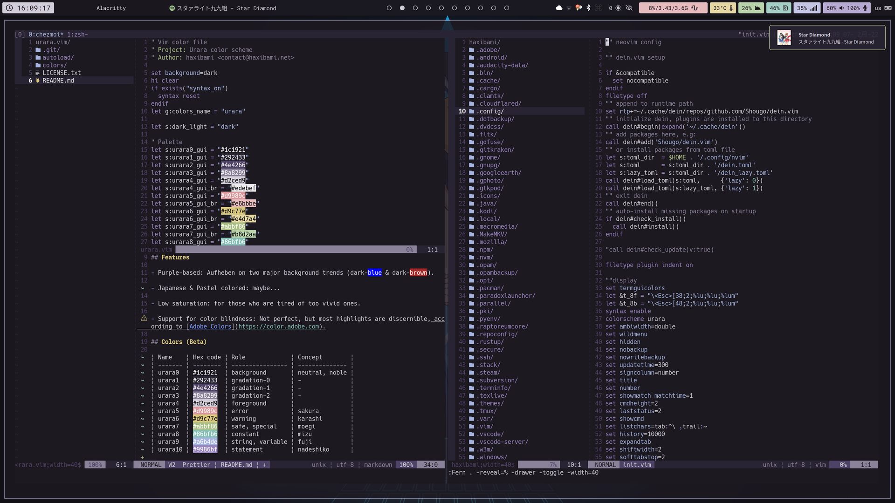

Repo はここ :point_down:

https://github.com/haxibami/urara.vim

## きっかけ

- Iceberg
  - 青系、かっこいい、やさしい
- Nord
  - 青系、かっこいい、やさしい
- Dracula
  - 紫系、かっこいい、けどビビッドすぎる

ダークで良いカラースキームが青系か茶色系ばかりで不思議に思っていた。暗めの青が背景として馴染むというのはなんとなく感じるところだが、もっと中間色の紫を使った（それでいてビビッドすぎない）テーマがあっていいと思う。そう、まさしく、

> Aufheben on two major background trends (dark-blue & dark-brown).

（https://github.com/haxibami/urara.vim より）

## 作る

Iceberg の人の[philosophy](https://cocopon.github.io/iceberg.vim/)を参考にしつつ、[Adobe Colors](https://color.adobe.com)とにらめっこした。あとは Vim の highlight の仕様を見ながら、設定を練り上げて……

## 感想

:neutral_face:

個人的には好きだけど（そりゃそうだ）、結局は好みの問題らしい。
