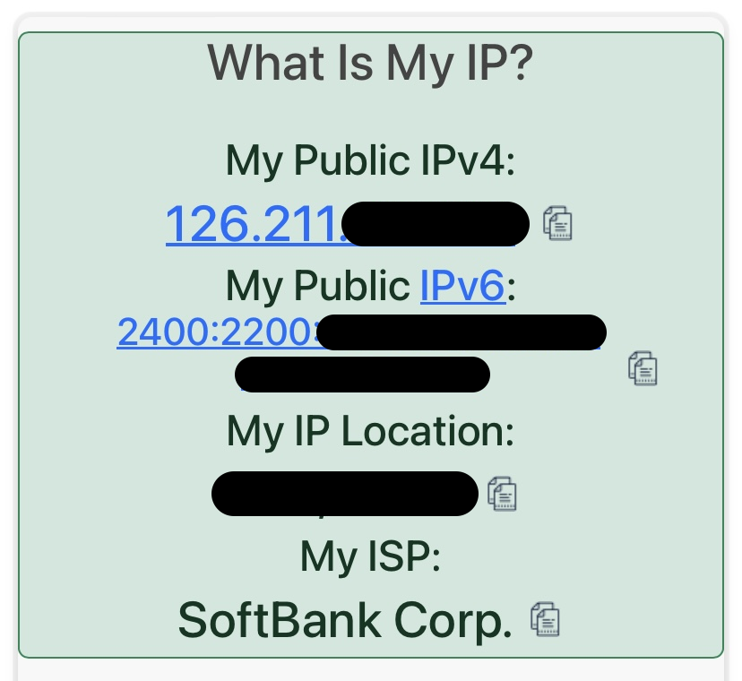

あけましておめでとう。iPhoneユーザ、かつIPv6\{狂信者|ファナティック\}のみなさんに嬉しいお知らせ。

## 概要

Y!mobile回線は以前からIPv6での接続に対応している（[参考](https://kimagurenote.net/kn/%E3%83%AF%E3%82%A4%E3%83%A2%E3%83%90%E3%82%A4%E3%83%AB#IPv6)）が、2024年1月現在、iPhone / iPad を利用している場合、なぜか自動APN設定 / 公式の構成プロファイルのいずれを使っても、IPv4のみで接続されてしまう。そこで公式の構成プロファイルをベースに、いくつか編集を加えたものをインストールしたところ、IPv6 / IPv4 デュアルスタックで接続できた。

## 検証環境

- iPhone XR 64GB（SIMフリー）[^1]
- iOS 17.2.1
- Y!mobile SIM（`n161`）

[^1]: 面倒なので試していないが、おそらくiPadでも同様にできる

## 手順

1. Y!mobile公式の、SIMフリー機向け構成プロファイル（`.mobileconfig`）をダウンロード

```bash
curl -O https://www.ymobile.jp/service/others/simonly/config/Ymobile_APN.mobileconfig
```

2. ダウンロードしたプロファイル（中身はXML）を編集
   - `plus.acs.jp` を `plus.acs.jp.v6` に
   - `AllowedProtocolMask` に `3` を指定 [^2]
   - `DefaultProtocolMask` はおそらく不要（`deprecated`）だが、一応 `3` を指定
     - 詳細は[Appleのドキュメント](https://developer.apple.com/documentation/devicemanagement/cellular/apnsitem)を参照

[^2]: ここの数値の設定次第ではIPv6のみの接続もできそうだが、現時点でIPv6シングルスタック対応ができているのは[ドコモくらい](https://www.docomo.ne.jp/info/news_release/2022/01/31_00.html)（+楽天？）なので、とくに意味はない

```diff title="差分"
--- original/Ymobile_APN.mobileconfig
+++ edited/Ymobile_APN.mobileconfig
@@ -8,26 +8,34 @@
         <key>AttachAPN</key>
         <dict>
           <key>Name</key>
-          <string>plus.acs.jp</string>
+          <string>plus.acs.jp.v6</string>
           <key>AuthenticationType</key>
           <string>CHAP</string>
           <key>Username</key>
           <string>ym</string>
           <key>Password</key>
           <string>ym</string>
+          <key>DefaultProtocolMask</key>
+          <integer>3</integer>
+          <key>AllowedProtocolMask</key>
+          <integer>3</integer>
         </dict>

         <key>APNs</key>
         <array>
           <dict>
             <key>Name</key>
-            <string>plus.acs.jp</string>
+            <string>plus.acs.jp.v6</string>
             <key>AuthenticationType</key>
             <string>CHAP</string>
             <key>Username</key>
             <string>ym</string>
             <key>Password</key>
             <string>ym</string>
+            <key>DefaultProtocolMask</key>
+            <integer>3</integer>
+            <key>AllowedProtocolMask</key>
+            <integer>3</integer>
           </dict>
         </array>
         <key>PayloadDescription</key>
```

3. 編集済みのプロファイルをお好みの手段（メールなど？）でiPhoneに転送し、インストール

## 結果



無事IPv6アドレスが降ってくる。なお通信速度等は特に変わらない。
